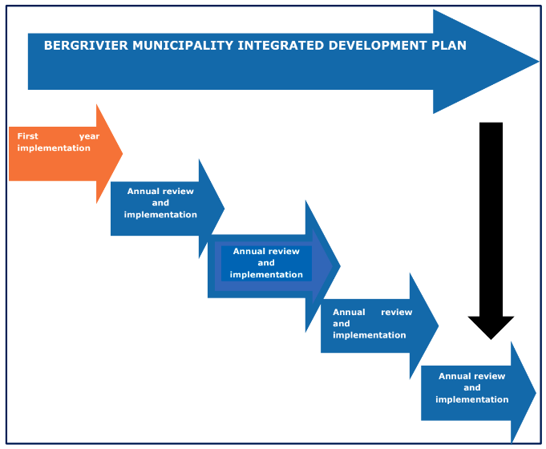

# The Fifth Generation Integrated Development Plan

The Integrated Development Plan (IDP) is a _**process and a plan**_ that is undertaken in terms of legislation and within the parameters of National, Provincial and District planning frameworks. The integrated development planning process is a consultative process that solicits input from a wide range of stakeholders including communities, community organisations, business sectors, relevant departments from the various spheres of government and departments within the municipality.

The IDP process aims to identify and prioritise community needs – and therefore municipal needs - and integrate them into a singular local level plan which indicates how municipal resources will be allocated to address these needs over the five-year cycle of the IDP.

The IDP also identifies critical development needs which fall within the functional mandate of the West Coast District Municipality, National and Provincial Government Departments and their public entities and indicates how these needs will be addressed in the short, medium and long term (where information is available) within the municipal area of jurisdiction and how these plans will align to municipal planning.

IDP’s for the term of office of the newly elected municipal councils that commence in November 2022, are referred to as the 5th generation IDP as it is the fifth IDP cycle since 2000. The essence of the 5th generation IDP is that it is a:

_“Single window of co-ordination” for:_

* Internal relationships within municipalities;
* Relationships between local and district municipalities, neighbouring municipalities and other spheres of government; and
* Relationships between local municipalities, other key stakeholders and the broader community.

The following diagram indicates the lifespan of the 5th generation IDP, the way it will be reviewed and the stage in the process reflected by this document.

_It should be emphasized that, due to the election date in November 2022 and the subsequent uncertainties of the exact election date prior to the announcement of the date, Council took a resolution to adopt the predecessor’s IDP with amendments. The 2023/24 review process is therefore a review of the amended IDP in 2022/23 financial year._

<figure><figcaption>
FIGURE 1: LIFE SPAN OF THE IDP
</figcaption></figure>
