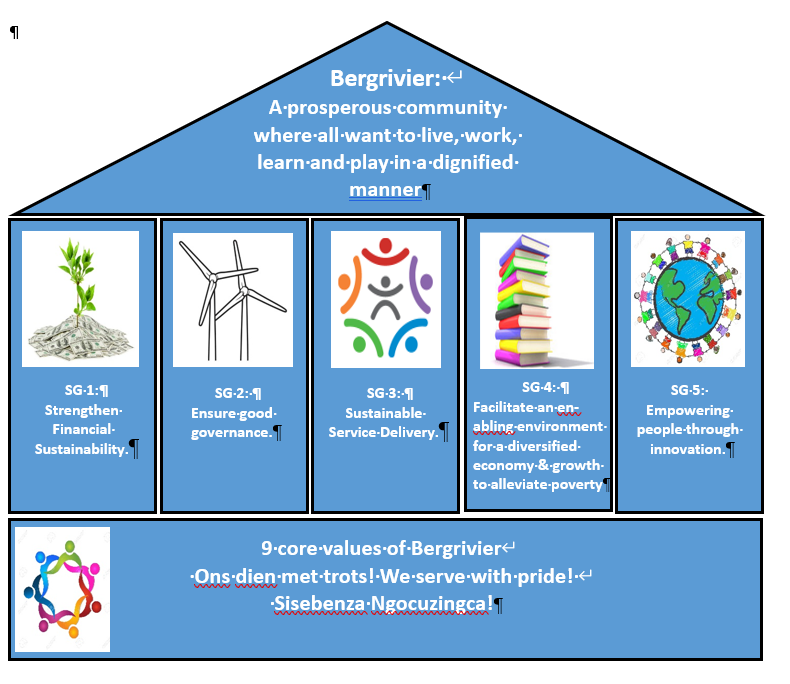

# Introduction: Vision, Mission and Strategic Objectives: 2017 - 2022

This Chapter sets out the strategic direction of Bergrivier Municipality for the 2022 – 2027 IDP cycle and is the most important part of the IDP. The Council of Bergrivier reviewed the vision and mission in August 2022 to firstly facilitate better alignment to the Key Performance Areas of Local Government, the National Development Plan (2030) and the Constitutional Objectives of Local Government and secondly to ensure alignment with the political mandate of Council.

The process needs to facilitate improved integration between the IDP and the budget (specifically that budgets are aligned with the developmental needs as identified and prioritized by communities) and with performance management as to ensure continuous monitoring of the implementation of the IDP through in-year performance reporting (as prescribed by National Treasury). The strategy of Bergrivier Municipality remains a high-level strategy that links the IDP goals and strategic objectives to functional development priorities. Development priorities derive from community needs, institutional needs and the Municipal Frameworks and Sector plans referred to in Chapter 7 and Chapter 8 of the IDP.

Chapter 10 contains the Municipality’s Key Performance Indicators that will enable the Municipality to measure to what extent it has delivered on its development priorities and in so doing achieved its strategic objectives.

The following is a visual representation of the vision and the newly formulated strategic goals of Bergrivier Municipality:

<figure><figcaption></figcaption></figure>
