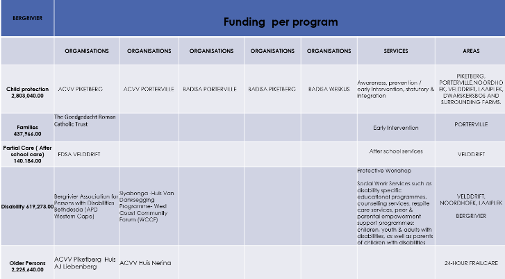

# Integration of National and Provincial Sector Department Programmes

It is always important to read and understand investment in the Bergrivier Municipal Area by the national and provincial governments in the context of the district. The following is an overview of the public sector investment in the West Coast District:

<figure><figcaption></figcaption></figure>

The following table and figures indicate provisional National and Provincial Department investment in the Bergrivier Municipal Area:

<figure><figcaption></figcaption></figure>

<figure><figcaption></figcaption></figure>

The following table is an overview of the transfers and allocations to Bergrivier Municipality over the next 5 years:

<table data-card-size="large" data-view="cards"><thead><tr><th>Project Name</th><th>Department</th><th>Project Status</th><th>IDMS Gate</th><th>Economic Classification</th><th>Adjustments 2022-23 (R)</th><th>Current Budget 2022-23 (R)</th></tr></thead><tbody><tr><td>Piketberg - Radie Kotze Hospital - Hospital layout improvement</td><td>Health</td><td>Design</td><td>Stage 4: Design Documentation</td><td>Buildings &#x26; other fixed structures</td><td>968 000</td><td>175 4000</td></tr><tr><td>C1097 Dwarskersbos Elandsbaai</td><td>Transport &#x26; Public Works</td><td>Practical Completion (100%)</td><td>Stage 6: Handover</td><td>Buildings &#x26; other fixed structures</td><td>0</td><td>3 000 000</td></tr><tr><td>West Coast: Berg River: Eendekuil: Planning: 43 Sites - IRDP - Phase 1</td><td>Human Settlements</td><td>Feasibility</td><td>Stage 3: Design Development</td><td>Transfers to Households</td><td>-834 000</td><td>166 000</td></tr><tr><td>West Coast: Berg River: Porterville: 171 Sites - Irdp - Phase 1</td><td>Human Settlements</td><td>Feasibility</td><td>Stage 3: Design Development</td><td>Transfers to Households</td><td>-2374 000</td><td>626 000</td></tr><tr><td>West Coast: Berg River: Piketberg: 43 Services: IRDP - Phase 1: Re- Imbursement for Services Installed</td><td>Human Settlements</td><td>Feasibility</td><td>Stage 3: Design Development</td><td>Transfers to Households</td><td>-1 859 000</td><td>641 000</td></tr><tr><td>West Coast: Berg River: Piketberg: 1000 - Ph 1: 200</td><td>Human Settlements</td><td>Feasibility</td><td>Stage 3: Design Development</td><td>Transfers to Households</td><td>-1 092 000</td><td>208 000</td></tr><tr><td>Bergrivier Trajekte Kamp (80 services) IRDP</td><td>Human Settlements</td><td>Feasibility</td><td>Stage 3: Design Development</td><td>Transfers to Households</td><td>-239 000</td><td>111 000</td></tr><tr><td>Velddrif Sandlelle (137 units) IRDP4</td><td>Human Settlements</td><td>Project Initiation</td><td>
Stage 1:

Initiation/ Pre- feasibility
</td><td>Buildings &#x26; other fixed structures</td><td>-16 000 000</td><td>0</td></tr><tr><td>Piketberg N7 Funding (47 sites) IRDP</td><td>Human Settlements</td><td>Project Initiation</td><td>
Stage 1:

Initiation/ Pre- feasibility
</td><td>Buildings &#x26; other fixed structures</td><td>-1 000 000</td><td>0</td></tr></tbody></table>

The following is an overview of the planned infrastructure investment in the Bergrivier Municipal Area:

_**i. Western Cape Provincial Treasury**_

&#x20;The following investment from Provincial Treasury is made in Bergrivier Municipality:

<figure><figcaption></figcaption></figure>

Outstanding issues that remain for future engagements include:

* The financial model for local government that is outdated and needs to be reviewed;
* Impact of Eskom on local government in terms of loss of income, cost to deliver alternative energy, environmental impact and NERSA tariff increases with a subsequent decrease in profit for municipalities to cross-subsidise other services;
* Rendering of services at a loss, such as housing delivery, NATIS services;
* The measurement of local spend as an enabler for local economic development;
* The cost for the rehabilitation of landfill sites.

_**ii.  Department of Agriculture**_**  **  &#x20;

<figure><figcaption></figcaption></figure>

<figure><figcaption></figcaption></figure>

<figure><figcaption></figcaption></figure>

Outstanding issues that remain for future engagements include:

* Sourcing of land for small scale farmers;
* Smart gardens to be implemented;
* Eviction from farms are becoming a serious burden for municipalities and the implications thereof need to be addressed.

_**iii.  Department of Transport and Public Works**_

<figure><figcaption></figcaption></figure>

<figure><figcaption></figcaption></figure>

<figure><figcaption></figcaption></figure>

<figure><figcaption></figcaption></figure>

Outstanding issues that remain for future engagements include:

* Ablution facilities at the river mouth in Laaiplek are not being maintained and cleaned;
* With the new developments at Winkelshoek, considerable pedestrian crossings take place over the N7. A crossing is urgently needed;
* Bergrivier Municipality is one of the best performing municipalities in the EPWP programme and a bigger allocation is required;
* The main road through Porterville is known as Voortrekker Street and a new design was done through a competition combined with the market square. Funding is required to implement the programme;
* The community of Dwarskersbos has been complaining for years of the dangers of heavy vehicles speeding through the town. Solutions for this problem must be sourced urgently;
* There is a need to regenerate the rail industry for Porterville, Piketberg and the rail from Lutzville to Saldanha Bay;
* The implementation of the Small-Town Regeneration Programme will require a multi-dimensional approach with the involvement of a number of stakeholders, national and provincial;
* There is a need for a paved walkway on the R44 from Jakkalskloof to DJ Pearce Lane in Porterville.

_**iv.  Human Settlements**_

<figure><figcaption></figcaption></figure>

<figure><figcaption></figcaption></figure>

<figure><figcaption></figcaption></figure>

Outstanding issues that remain for future engagements include:

* The growing back yard dwellers population is becoming a serious concern, especially as legislation prevent a municipality from providing more than one connection to an erf. Even if a system can be implemented, Bergrivier Municipality would not be able to afford to provide these services;
* Need for housing for farm workers;
* Housing for elderly in Bergrivier Municipal Area;
* Municipalities struggle to provide GAP-housing due to the high cost of engineering services;
* Housing is a function shared between National and Provincial government and municipalities implement housing projects on an agency basis. The financial implications for a municipality is significant and needs to be addressed.

_**v. Department of Economic Development and Tourism**_

<figure><figcaption></figcaption></figure>

Outstanding issues that remain for future engagements include:

* The strategy to develop Porterville as a tourism destination of choice needs to be supported. Over and above the upgrade of the main road, the upgrade of the market square with new tourism office will lead to a new feel of the town.
* The assistance of the department with an investment strategy is required;
* The implementation of the Small-Town Regeneration Programme will require a multi-dimensional approach with the involvement of several stakeholders, national and provincial.

_**vi.  Department of Social Development**_

<figure><figcaption></figcaption></figure>

<figure><figcaption></figcaption></figure>

<figure><figcaption></figcaption></figure>

<figure><figcaption></figcaption></figure>

<figure><figcaption></figcaption></figure>

Outstanding issues that remain for future engagements include:

* The establishment of a night shelter in Piketberg;
* Rising levels of domestic violence in all the towns;
* Housing for the elderly

_**vii.  Department of Health Services**_

<figure><figcaption></figcaption></figure>

Outstanding issues that remain for future engagement include:

* Waiting rooms at clinics completely inadequate;
* Clinic facilities in Goedverwacht and Wittewater to be upgraded;
* Ambulance services to be increased;
* Better access to health care facilities for farm workers;
* Numerous complaints are being received of patients waiting at clinics for a full day to wait for doctors not working full days at the clinic. Level of service provided is also disputed.

_**viii.  Department of Education**_

<figure><figcaption></figcaption></figure>

Outstanding issues that remain for future engagement include:

* Bergrivier Municipal Area is the only area without a tertiary institution in the West Coast;
* The outcome of the current curriculum does not address the needs of the labour/employment market;
* Absenteeism of learners in Steynville Primary and Secondary Schools is a serious problem;
* The urgent need for a new school in Piketberg with overcrowding in Steynville Primary and Secondary School leading to poor results and accompanying social problems;
* Learners with special needs can only attend school until the age of 12/13. These children are then being sending home;
* Growth in Porterville due to Voorberg Correctional Services and seasonal workers leading to a need for an additional school or Porterville Primary School to be extended to a Secondary school;
* Annually an increase in demand for an English medium school is experienced;
* Bergrivier Municipality is in discussions with the School of Skills in Bonnievale to establish a similar school in Piketberg.

_**ix. Department of Cultural Affairs and Sport**_

<figure><figcaption></figcaption></figure>

<figure><figcaption></figcaption></figure>

Outstanding issues that remain for future engagement include:

* The establishment of an Arts and Craft Centre in Porterville;
* A cultural centre in Piketberg to empower the youth in dance, music and drama;
* Infrastructure, public ablution facilities and rest rooms for the players are needed at the sport ground in Wittewater;
* Request DCAS to support Local Sport Councils with funding, training and empowerment, especially in turf management, facilities management and event management;
* Indoor sport facility in Piketberg;
* Synthetic/tartar surface for athletics in Velddrif;
* Urgent upgrade and maintenance of the Jan Danckaert Museum in Porterville;
* Porterville Cricket Club has been in existence for many years without their own field; and
* Sport facilities at the Youth Centre in Piketberg.

_**x.  Department of Community Safety**_

<figure><figcaption></figcaption></figure>

Outstanding issues that remain for future engagement include:

* Numerous complaints are being received from the public on the role state prosecutors play. It appears cases have easily been withdrawn being counterproductive to the work of law enforcement agencies;
* There is an urgent need to fund material and equipment with specific reference to cameras;
* The SAPS services in Velddrif is inadequate and did not increase with the exponential growth in the population.

_**xi.  Department of Local Government**_

Outstanding issues that remain for future engagement include:

* Funding is required for the rehabilitation of landfill sites;
* Functional boundaries of SAPS, Justice, Health, Social Development etc differ from the municipal boundaries making intergovernmental relation complex;
* Decision regarding Fire Services is urgent;
* Active participation in the Small-Town Regeneration Programme will be required.
