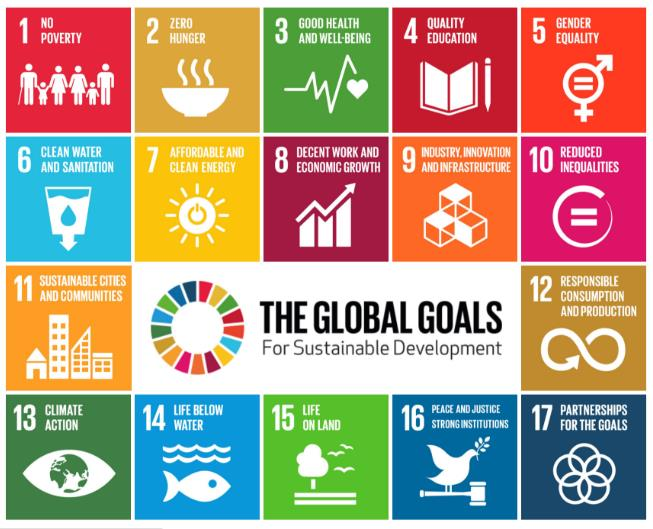
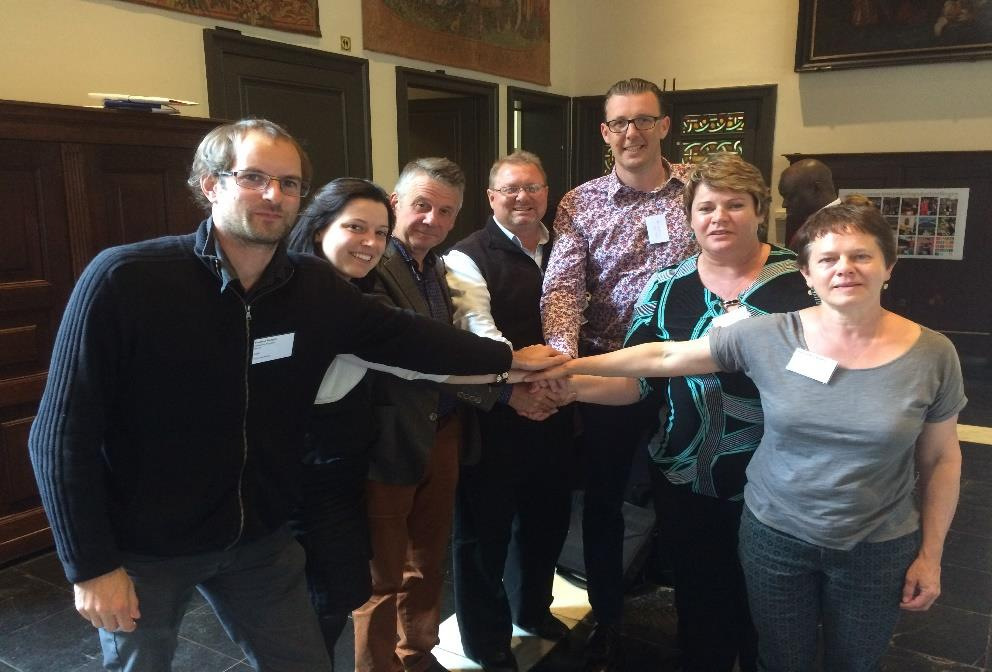

# Global Planning Framework

The following paragraphs provide an overview of the Global Planning Framework that this IDP aligns to.

## 2030 AGENDA FOR SUSTAINABLE DEVELOPMENT

This Agenda is a plan of action for people, planet and prosperity. It seeks to strengthen universal peace in larger freedom. The plan recognises that eradicating poverty in all its forms and dimensions, including extreme poverty, is the greatest global challenge and an indispensable requirement for sustainable development. All countries and all stakeholders, acting in collaborative partnership, need to implement this plan. The 17 Sustainable Development Goals and 169 targets demonstrate the scale and ambition of the new universal Agenda. It seeks to build on the Millennium Development Goals and complete what these did not achieve. The focus is also on the human rights of all and to achieve gender equality and the empowerment of all women and girls as it is integrated and indivisible and balance the three dimensions of sustainable development: the economic, social and environmental. The Goals and targets will stimulate action over the next fifteen years in areas of critical importance for humanity and the planet:

**People**

The plan aims to end poverty and hunger, in all its forms and dimensions, and to ensure that all human beings can fulfil their potential in dignity, equality and in a healthy environment.

**Planet**

The plan aims to protect the planet from degradation, including through sustainable consumption and production, sustainably managing its natural resources and taking urgent action on climate change, so that it can support the needs of the present and future generations.

**Prosperity**

The plan aims to ensure that all human beings can enjoy prosperous and fulfilling lives and that economic, social and technological progress occurs in harmony with nature.

**Peace**

The plan aims to foster peaceful, just and inclusive societies which are free from fear and violence. There can be no sustainable development without peace and no peace without sustainable development.

**Partnership**

The plan aims to mobilize the means required to implement this Agenda through a revitalised Global Partnership for Sustainable Development, based on a spirit of strengthened global solidarity, focussed on the needs of the poorest and most vulnerable and with the participation of all countries, all stakeholders and all people.

The above goals and discussion can be outlined as follows:

<figure><figcaption></figcaption></figure>

Bergrivier Municipality, in partnership with Heist-op-den-Berg, co-signed the Agenda for Sustainable Development in Antwerp in 2016 as part of the programme to work together for a better world. The photo depicts the ceremony where the agreement was co-signed:

<figure><figcaption></figcaption></figure>
