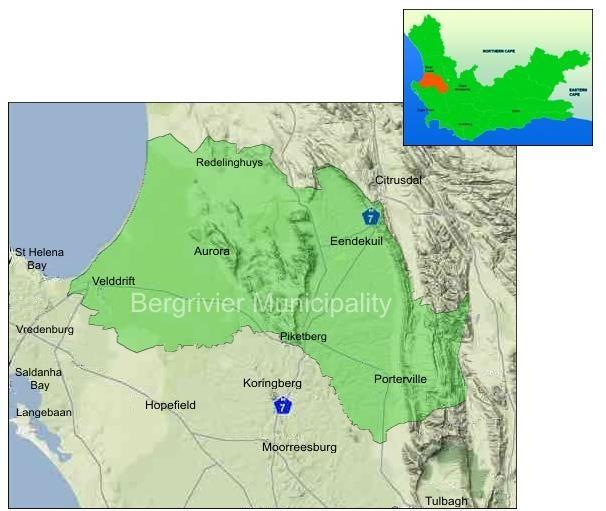

# Geographic Overview

Bergrivier Municipality is situated in the West Coast District of the Western Cape Province. The Municipality is bordered to the north by Cederberg Municipality, to the west by Saldanha Bay Municipality, to the south by Swartland Municipality and to the east by Drakenstein and Witzenberg Municipalities.

The Municipality covers a geographic area of approximately 4 407, 04 km2 and is geographically diverse. It includes 9 urban settlements, approximately 40 kilometres of coastline and a vast rural area. The main urban settlements that constitute the Municipality are: Piketberg which is the administrative seat, Porterville, Velddrif (which includes Port Owen, Laaiplek and Noordhoek), Dwarskersbos, Eendekuil, Aurora, Redelinghuis, Goedverwacht and Wittewater. The latter two are Moravian settlements on private land.

<figure><figcaption>
Figure 2: Map of Bergrivier Municipality
</figcaption></figure>
