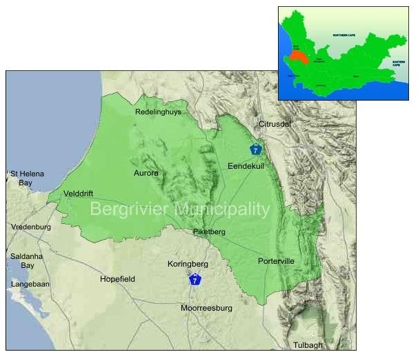

# Capital Programme

Our priority remains the development and maintenance of our infrastructure resulting in Technical Services receiving 79% of the Capital Budget allocation over the three-year budget period. The following table sets out the Municipality’s capital expenditure over the next three years:

| ORIGINAL BUD22/23 | ADJUSTMENT BUD22/23 | FINAL BUD23/24 | FINAL BUD24/25 | FINAL BUD25/26 |
| ----------------- | ------------------- | -------------- | -------------- | -------------- |
| 83 154 566,00     | 82 910 344,00       | 77 422 609,00  | 73 312 651,00  | 70 668 826,00  |

The following map and table set out the capital expenditure per town. Bergrivier projects are projects where the allocation will be divided between towns.

<figure><figcaption>
FIGURE 15: SPATIAL REPRESENTATION OF MUNICIPAL CAPITAL DEVELOPMENT PROGRAMME
</figcaption></figure>

The table hereunder provides a summary of the capital spending per Town over the MTREF

| TOWN            | SUM OF FINAL 23/24 | SUM OF FINAL 24/25 | SUM OF FINAL 25/26 |
| --------------- | ------------------ | ------------------ | ------------------ |
| AUR             | 366,333.00         | 5,310,435.00       | 5,748,391.00       |
| BR              | 36,500,652.17      | 31,875,086.96      | 20,617,826.09      |
| DKB             | 1,015,000.00       |  -                 | 500,000.00         |
| EK              | 300,000.00         |  -                 | 2,350,000.00       |
| PB              | 21,381,232.00      | 11,661,478.00      | 15,827,826.00      |
| PV              | 3,884,261.00       | 4,049,130.00       | 2,620,000.00       |
| PV              | 2,529,914.00       | 1,000,000.00       | 4,500,000.00       |
| GVW             |  -                 |  -                 | 1,500,000.00       |
| VD              | 11,285,217.00      | 19,416,522.00      | 16,864,783.00      |
| PB/RH           |  -                 |  -                 | 140,000.00         |
| PV & PB & VD    | 160,000.00         |  -                 |  -                 |
| **GRAND TOTAL** | **77 422 609,00**  | **73 312 651,00**  | **70 668 826**     |

The following table contains the three-year capital expenditure programme as contained in the budget.

<figure><figcaption></figcaption></figure>

<figure><figcaption></figcaption></figure>

<figure><figcaption></figcaption></figure>

<figure><figcaption></figcaption></figure>

<figure><figcaption></figcaption></figure>

<figure><figcaption></figcaption></figure>

<figure><figcaption></figcaption></figure>

<figure><figcaption></figcaption></figure>

<figure><figcaption></figcaption></figure>

<figure><figcaption></figcaption></figure>

<figure><figcaption></figcaption></figure>

<figure><figcaption></figcaption></figure>

<figure><figcaption></figcaption></figure>

<figure><figcaption></figcaption></figure>

<figure><figcaption></figcaption></figure>
