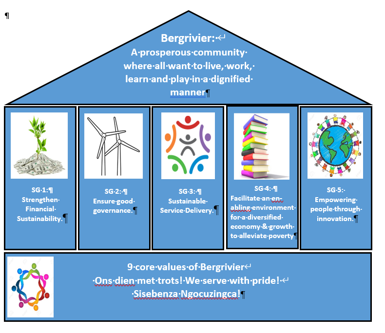
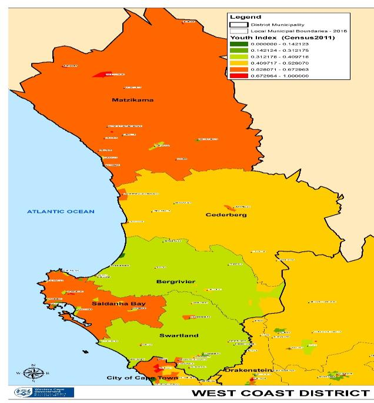
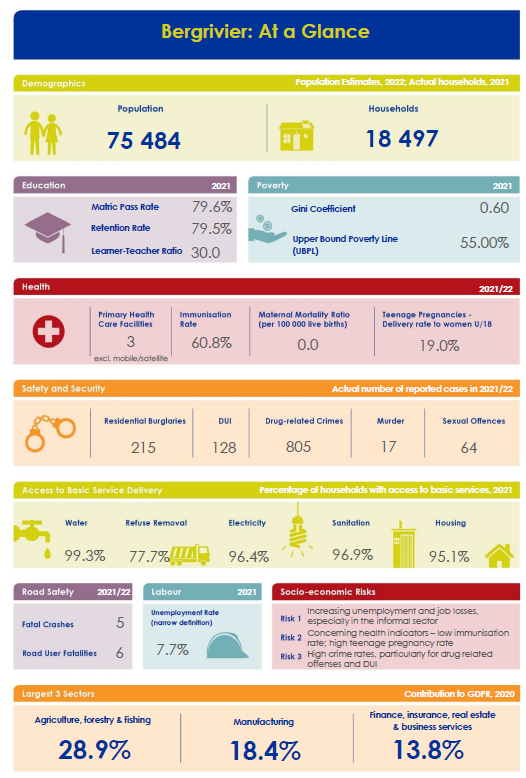

# Overview of the chapters contained in the Integrated Development Plan

## Chapter 1: Purpose of the IDP

Integrated development planning is both a process and a plan that is undertaken in terms of legislation and within the parameters of National, Provincial and District planning frameworks. The integrated development planning process is a consultative process that solicits input from a wide range of stakeholders.

The IDP process aims to identify and prioritise Municipal, and Community needs and integrate them into a singular local level plan which indicates how resources will be allocated to address these needs over the fiveyear cycle of the IDP. The IDP also identifies critical development needs which fall within the functional mandate of the West Coast District Municipality, National and Provincial Government Departments and their Public Entities and indicates how these needs will be addressed in the short, medium and long term (where information is available) and how they align to municipal planning.

## Chapter 2: Vision, mission, strategic goals, strategic objectives and values

### **\* Strategy**

Chapter 2 is the most important Chapter of the IDP as it explains the vision, mission, strategic goals and strategic objectives of Bergrivier Municipality. It also sets out the development priorities. Bergrivier’s strategy remains a high-level strategy that links IDP strategic goals and strategic objectives to functional development priorities. Development priorities derive from community needs, institutional needs and the Municipal Frameworks and Sector Plans. Key Performance Indicators have been developed to measure the extent to which we have achieved our strategic objectives and game changers.

### **\*** Vision and mission

The vision and mission of Bergrivier Municipality have been redrafted given the new situational analysis and mandate of Council. They are as follows:

> **Vision**
>
> Bergrivier: a prosperous community where all want to a live, work, learn and play in a dignified manner.
>
> Bergrivier: ‘n Vooruitstrewende gemeenskap waar almal wil leef, werk, leer en speel op ‘n menswaardige manier.
>
> **Mission**
>
> Commitment to sustainable development and the delivery of services that are responsive to the
>
> developmental needs of all communities in Bergrivier Municipality.

### Goals, Objectives and Development Priorities

The following table sets out the newly formulated strategic goals and strategic objectives. These goals and objectives have been aligned with the National and Provincial strategic goals and contains game changers identified by the municipality to ensure that certain areas enjoy dedicated attention and will have an impact on addressing developmental aspects.

<figure><figcaption></figcaption></figure>

<table data-card-size="large" data-view="cards"><thead><tr><th>STRATEGIC GOAL</th><th>STRATEGIC OBJECTIVES</th></tr></thead><tbody><tr><td>Strengthen financial sustainability</td><td><ul><li>To budget strategically</li><li>Entrench the Long-Term Financial Plan in the planning, implementation and management of the organisation</li><li>Diversify revenue and ensure value for money services</li><li>Ensure sustainable financial risk and asset management</li><li>Diversify by sourcing grant funding to support projects, programmes and initiatives of Council</li><li>Ensure transparency in financial management by ensuring that all financial records are accurate, reliable and timely</li></ul></td></tr><tr><td>Ensure good governance</td><td><ul><li>Create an efficient, effective, economic and accountable administration.</li><li>Provide a transparent and corruption free municipality.</li><li>Accountable leadership supported by professional and skilled administration.</li><li>Accountable leadership supported by professional and skilled administration.</li><li>A customer centred approach to everything.</li></ul></td></tr><tr><td>Sustainable service delivery</td><td><ul><li>Develop and provide bulk infrastructure within the climate change risks.</li><li>Maintain existing bulk infrastructure and services.</li><li>Develop, manage and regulate the built environment.</li><li>Source alternative sources of energy in the context of national electricity provision.</li><li>Conserve and manage the natural environment and mitigate the impacts of climate change.</li></ul></td></tr><tr><td>Facilitate an enabling environment for a diversified economy and growth to alleviate poverty.</td><td><ul><li>Improve the regulatory environment for ease of doing business.</li><li>Promote tourism.</li><li>Alleviate poverty through job creation in municipal driven projects and programmes.</li><li>Ensure all policies and systems in Bergrivier Municipality support poverty alleviation.</li><li>Attract investment through catalytic infrastructure.</li></ul></td></tr><tr><td>Empowering people through innovation.</td><td><ul><li>To promote healthy lifestyles through the provision of sport, recreational and other facilities and opportunities.</li><li>Promote continued partnerships for youth development.</li><li>Promote a safe environment for all who live in Bergrivier Municipal Area.</li><li>Develop a Master Plan for "Smart Cities" in Bergrivier Municipal Area.</li></ul></td></tr></tbody></table>

## Chapter 3: Alignment: International, National. Provincial and District Levels

### \* LEGAL FRAMEWORK

The IDP is compiled in terms of the following key legislation:

* The Constitution of South Africa, (1996).&#x20;
* The Local Government: Municipal Systems Act, 2000 (Act 32 of 2000) (Municipal Systems Act) read together with the Municipal Planning and Performance Regulations, Regulation 796 of 2001 (Municipal Planning and Performance Regulations);&#x20;
* The Local Government: Municipal Finance Management Act, 2003 (Act 56 of 2003) (MFMA).

### \* PLANNING FRAMEWORK

This IDP aligns to Global, National, Provincial and District Planning Frameworks, the most significant being the following:

<table data-card-size="large" data-view="cards"><thead><tr><th>CATEGORY</th><th>FRAMEWORK</th></tr></thead><tbody><tr><td><strong>Global planning Frameworks</strong></td><td><ul><li>2030 Agenda for Sustainable Development</li></ul></td></tr><tr><td><strong>National Planning Frameworks</strong></td><td><ul><li>National Development Plan, 2030</li><li>The Medium-Term Strategic Framework: (MTSF)</li><li>National Key Performance Areas (KPA) of Local Government</li><li>Back to Basics</li></ul></td></tr><tr><td><strong>Provincial Planning Frameworks</strong></td><td><ul><li>Provincial Strategic Plan</li><li>One Cape 2040</li><li>Western Cape Spatial Development Plan</li></ul></td></tr><tr><td><strong>District Planning Frameworks</strong></td><td><ul><li>IDP must align with the West Coast District Municipality IDP and their regional strategies as well as with the Joint District Management Plan.</li><li>JDMA</li></ul></td></tr></tbody></table>

## Chapter 4: 'Baseline' - A situational Analysis

Bergrivier Municipality is situated in the West Coast District of the Western Cape Province.

<figure><figcaption></figcaption></figure>

The Municipality covers a geographic area of 4 407.04 km2. The Municipality is geographically diverse and includes 9 urban settlements, approximately 40 kilometres of coastline and a vast rural area. The main urban settlements that constitute the Municipality are: Piketberg which is the administrative seat, Porterville, Velddrif (which includes Laaiplek and Noordhoek), Dwarskersbos, Eendekuil, Aurora, Redelinghuis, Goedverwacht and Wittewater. Bergrivier Municipality was demarcated into 7 wards for the 2016 Municipal Election in terms of the Municipal Demarcation Act, 1998 (Act 27 of 1998).

Chapter 4 is a very important chapter as it provides a baseline in profiling Bergrivier Municipal Area leading to the formulation of strategic goals and strategic objectives. As this chapter is comprehensive, the dashboard information from the _**Socio-Economic Profile**_ from Western Cape Provincial Government is used to summarise the chapter:

<figure><figcaption></figcaption></figure>

## Chapter 5: The Process of Public Participation

INTEGRATED DEVELOPMENT PLAN: PROCESS

The IDP process took place in accordance with a Time Schedule of Key Deadlines (Process Plan) that was approved by the Municipal Council in terms of Sections 21(1) (b) and 53(1) (b) of the MFMA read together with Sections 28 and 34 of the Municipal Systems Act. The IDP and budget processes are two distinct but integrally linked processes which must be coordinated to ensure that they consistently align to one another.

The Time Schedule of Key Deadlines (Process Plan) made provision for public participation mechanisms and procedures to allow the public to provide input onto the IDP review.

The public participation mechanisms include:

**INDIVIDUAL SECTOR ENGAGEMENTS**

The Municipality has embarked on a process of enhancing its public participation through individual sector engagements which are proving to be very effective as they focus on issues as well as ways and means of resolving issues jointly. Sector engagements always commence in September/October of a financial year during which inputs from the sectors are being requested and ends in April/May of the same financial year during which feedback is given on the inputs received. The Municipal Area was divided into the following sectors:

<figure><figcaption></figcaption></figure>

The Executive Mayor and Municipal Manager normally meet twice annually with sectoral leaders from all sectors to gather input from the community leaders into the strategic direction of the Municipality.

**WARD COMMITTEE MEETINGS**

In terms of the approved Time Schedule of Key Deadlines, two series of Ward Committee Meetings are convened as part of the IDP/budget process. The first series of meetings are held in September/October of each financial year and is aimed to identify the various needs and priorities of communities and wards. The second series of Ward Committee Meetings is held in March/April of the same financial year and is aimed to provide Ward Committees with the opportunity to comment on the Draft IDP and Budget.

**TOWN BASED PUBLIC MEETINGS**

In terms of the approved Time Schedule of Key Deadlines, two series of town based public meetings are convened as part of the IDP / budget process. The first series of public meetings is held in September/ October of a financial year together with the ward committee meetings to explain the IDP/budget process, and to determine the needs of the communities. The second series of meetings is held in March/April of the same financial year and is aimed at providing the Community with the opportunity to comment on the Draft IDP and Budget.

**IDP REPRESENTATIVE FORUM**

On 28 August 2012, the Municipal Council approved the establishment of an IDP Representative Forum in terms of Section 15 of the Local Government: Municipal Planning and Performance Management Regulations of 2001. IDP Representative Forums are convened geographically in 2 of the 3 largest town during September and April of each financial year. The format of the IDP Representative Forum was changed and is normally thematic. Representatives from the District Municipality, Provincial Government Departments, Ward Committees, NGO’s and Sector Representatives are normally invited together with sector leaders in the community. The workshops aim to re-affirm critical development challenges and identify potential game changers and interventions. This forum is facilitated jointly by the Executive Mayor and the Municipal Manager and strategically used to unite all key stakeholders in the whole of Bergrivier Municipal Area behind the vision and Integrated Development Plan.

## Chapter 6: Needs Identified Through Public Participation Process

A comprehensive process has been followed over the last few years to determine the real needs of the communities, including needs addressed by sector departments. These needs have been captured in a spreadsheet with filters. Needs that can be addressed by operational daily processes, will also be addressed. These needs are being reviewed on an annual basis and the reviewed needs have been included in Chapter 6.

## Chapter 7: Sector Plans and Other Frameworks

### **\* COMPOSITION OF THE MUNICIPALITY**

Bergrivier Municipality is established in terms of Section 12 of the Local Government: Municipal Structures Act, 1998 (Act 117 of 1998) as a Municipality with an Executive Mayoral System combined with a Ward Participatory System. Section 2(b) of the Municipal Systems Act states that a Municipality is constituted by its political structures, administration and community.

<figure><figcaption></figcaption></figure>

At Bergrivier Municipality we believe that we are 3 equal partners and that when we work seamlessly together, that is where the magic happens.

Political structures include:

* The Municipal Council which comprises 13 Councillors, seven of whom are Ward Councillors and six of whom are Proportional Representation (PR) Councillors;
* The Office of the Speaker: the Speaker is the Chairperson of the Municipal Council;&#x20;
* The Executive Mayor and Executive Mayoral Committee; and
* Portfolio Committees for each Directorate.

The Administration, which comprises the Office of the Municipal Manager and 4 Directorates, namely a Corporate Services, Community Services, Technical Services and Financial Services Directorates. The Senior Management positions are all filled. Bergrivier Municipality is fortunate that all Section 57 appointments (Directors) are permanent positions.

Community Structures include Ward Committees, the IDP Representative Forum and Sector Engagements, Community Policing Forums, SMME Forums and many more where the municipality engage meaningfully with community leaders and – members.

### \* POWERS AND FUNCTIONS

Section 156, read together with Schedules 4B and 5B of the Constitution sets out the functions of a Municipality. Section 84 of the Municipal Structures Act regulates the division of these functions between the District and Local Municipality.

### \* HIGH LEVEL FRAMEWORKS AND SECTOR PLANS

The Municipality has several high-level frameworks and sector plans that must be read in conjunction with this newly formulated fourth generation IDP. These are frameworks and plans that are required in terms of legislation. The table below provides an overview of these frameworks and plans and the status thereof.

<table data-card-size="large" data-view="cards"><thead><tr><th>FRAMEWORK / SECTOR PLAN</th><th>STATUS</th></tr></thead><tbody><tr><td>Spatial Development Framework (SDF) (2013).</td><td>Approved by the Municipal Council on 26 February 2019. To be reviewed in 5 years’ time (2024)</td></tr><tr><td>Revised Disaster Management Plan (DMP) and Risk Preparedness Plans (Contingency Plans)</td><td>Approved by Municipal Council in May 2016 and revised in 2019/20.</td></tr><tr><td>Human Settlements Pipeline (HSP)</td><td>Approved by the Municipal Council in 2021.</td></tr><tr><td>Water Services Development Plan (WSDP)</td><td>A revised WSDP has been developed and approved for the years 2017 – 2022. A Water Service Audit must be approved before the end of October each year by the Mayoral Committee.</td></tr><tr><td>Integrated Waste Management Plan (IWMP)</td><td>Approved by Council on 18 October 2011 i.t.o. NEMA:WA. A 4 th Generation IWMP was approved 30 July 2019. Audit Report was approved 25 January 2022.</td></tr><tr><td>Bergrivier Municipal Second-Generation Coastal Management Programme, 2019-2024</td><td>Adopted by Council in November 2019</td></tr><tr><td>Integrated Transport Plan. (ITP)</td><td>Approved by Council 2019 - 2024.</td></tr><tr><td>Municipal Infrastructure Plan (MIP)</td><td>Completed, but a process to update masterplans will commence in 2023</td></tr><tr><td>Groot Berg River Estuary Draft Estuarine Management Plan</td><td>
Draft, August 2021. The National Estuarine Management Protocol identifies Cape Nature as the Responsible Management Authority responsible for the development of the Groot Berg River Estuarine

Management Plan as well as being responsible for the co- ordination of its implementation. Client: Western Cape

Government, Department of Environmental Affairs &#x26; Development Planning
</td></tr><tr><td>Community and Rural Safety Plan (CRSP)</td><td>Approved on 30 March 2021.</td></tr><tr><td>Integrated Second Generation of the West Coast district Municipality inclusive of the five Local Municipalities Air Quality management Plan, (2019-2024</td><td>Adopted by Council in November 2019</td></tr><tr><td>Strategic Risk Register (RR).</td><td>Approved by the Municipal Council annually</td></tr><tr><td>Information Communication Technology Plan &#x26; Strategy)</td><td>Reviewed by Council 14 June 2021</td></tr><tr><td>Employment Equity Plan (EE)</td><td>Plan covers a 5-year period- 1 December – 30 September 2024</td></tr><tr><td>Workplace Skills Plan (WSP)</td><td>Reviewed annually (stay the same)</td></tr><tr><td>LED Strategy</td><td>Approved by the Municipal Council in 2021</td></tr><tr><td>Bergrivier Municipality Biodiversity Report</td><td>Approved by the Municipal Council in 2010.</td></tr><tr><td>Local Biodiversity Strategic And Action Plan (LBSAP)</td><td>Approved by the Municipal Council .</td></tr><tr><td>Local Biodiversity Strategic And Action Plan (LBSAP)</td><td>Approved by the Municipal Council in March 2014.</td></tr><tr><td>The Bergrivier Municipality: Invasive species monitoring, control and eradication plan, dated June 2020</td><td>Approved and adopted by Mayco on 11 June 2020.</td></tr></tbody></table>

### \* PROGRAMMES, SYSTEMS AND BY-LAWS

The Municipality also has several programmes, plans and systems in place namely:

**INTEGRATED MUNICIPAL INFORMATION SYSTEM**

* Bergrivier Municipality identified the need for an integrated document and records management system that supports the medium to long term information needs of the municipality. This was addressed by a fully functional IMIS system. Furthermore, greater attention was given to the governance of IT through the policies and applications that are in operation.

**COMMUNICATION**

* The Municipality publishes bi-annual newsletters to inform residents about important Municipal matters and has its own website www.bergmun.org.za on which news, general information, public documents and calls for tenders and quotes are placed.

**PERFORMANCE MANAGEMENT**

*   Performance Management is done in terms of the Performance Management Policy approved in 2017. The Performance Management System is an internet-based system that uses the approved Service Delivery Budget Implementation Plan (SDBIP) as its basis. The SDBIP is a layered plan comprising a Top Layer SDBIP and Departmental SDBIPs. The Top Layer SDBIP is developed following the approval of the budget and comprises quarterly high-level service delivery targets. Performance reporting on

    the Top Layer SDBIP is done to the Mayoral Committee and Council on a quarterly, half yearly (Mid- year Budget and Performance Assessment Report) and annual basis (Annual Report). These performance reports are made available on our website. The Ignite system is being used for performance management.

**COMPLIANCE MANAGEMENT**

* Compliance is managed through an internet-based compliance management system, Eunomia, and reports on compliance is submitted regularly.

**AUDIT QUERY MANAGEMENT**

* The management of internal and external audit queries is managed through an internet-based audit query management system from Ignite, namely Audit Assist. A report on outstanding audit queries is submitted to the Performance Audit Committee and relevant Portfolio Committee on a quarterly basis.

**RISK MANAGEMENT**

* The Municipality’s risks are managed in terms of a strategic and operational risk register which is managed through an internet-based risk management system. A report on the management of risks is submitted to the Risk Committee and relevant Portfolio Committee on a quarterly basis

**COMMUNITY DEVELOPMENT**

* Bergrivier Municipality is committed to the Constitutional mandate of Local Government to view all functions of Municipalities through the lens of the objects for local government as provided in Section 152 of the Constitution of South Africa. This section stipulates that the promotion of social and economic development is an important object that Municipalities must consider while delivering on their services. It is our function to know where the needs are and to know and explore the resources to fulfil these needs, and then to bring these two together through effective networking, co-operation and the building of sustainable partnerships;

**MUNICIPAL BY-LAWS**

* By-laws are in place and are revised as and when required.

## Chapter 8: Municipal Programmes Linked to Strategic Goals

The municipality as the enabler and facilitator of the Integrated Development Plan needs to plan programmes and projects for the period 2022 – 2027. These plans must be linked to the strategic goals and objectives as outlined in Chapter 2 and must ensure that the identified goals and objectives are being reached. These programmes/projects can at the time of drafting the IDP either be funded or unfunded but needs to be incorporated into the IDP to ensure that the planning process is complete. Funding for the unfunded programmes/projects necessarily needs to be sourced.

## Chapter 9: The Alignment of the IDP with the Budget

### BUDGET INTEGRATION

The Fourth Generation IDP is characterized by a concerted effort to ensure that the IDP and the budget are aligned and that the needs identified by the communities are reflected in the budget. Considerable research was also done by the Directorate Technical Services to determine the status quo of bulk infrastructure in Bergrivier as to determine affordability and sustainability of services in future.

The following table sets out the Municipality’s capital expenditure over the next three years:

| FINAL BUDGET 21/22 | ADJUSTED BUDGET 22/23 | FINAL BUDGET 23/24 | FINAL BUDGET 24/25 | FINAL BUDGET 25/26 |
| ------------------ | --------------------- | ------------------ | ------------------ | ------------------ |
| 55 813 607,00      | 55 813 607,00         | 77 432 609,17      | 73 312 651,96      | 70 668 826,09      |

The following table sets out the capital expenditure per town:

| TOWN                               | FINAL BUDGET 23/24 | FINAL BUDGET 24/25 | FINAL BUDGET 25/26 |
| ---------------------------------- | ------------------ | ------------------ | ------------------ |
| Bergrivier                         | 37 100 652,17      | 31 875 086,96      | 20 617 826,09      |
| Velddrif                           | 9 095 217,00       | 19 416 522,00      | 20 617 826,09      |
| Redelinghuis                       | 2 529 914,00       | 1 000 000,00       | 4 500 000,00       |
| Piketberg                          | 21 881 232,00      | 11 661 478,00      | 15 827 826,00      |
| Dwarskersbos                       | 1 015 000,00       |  -                 | 500 000,00         |
| Porterville                        | 4 984 261,00       | 4 049 130,00       | 2 620 000,00       |
| Aurora                             | 366 333,00         | 5 310 435,00       | 5 748 391,00       |
| Piketberg/Redelinghuis             |  -                 |  -                 | 140 000,00         |
| Porterville & Piketberg & Velddrif | 160 000,00         |  -                 |  -                 |
| Eendekuil                          | 300 000,00         |  -                 | 2 350 000,00       |
| Goedverwacht                       |  -                 |  -                 | 1 500 000,00       |
| Grand Total                        | **77 432 609,17**  | **73 312 651,96**  | **70 668 826,09**  |

Projects listed as Bergrivier are projects where the funding will be allocated to two or more towns or the Municipal Area in its totality.

## Chapter 10: Performance Management

The implementation of this IDP will be measured by outcomes based key performance indicators whereas the output based KPI’s will be contained in the Municipality’s Service Delivery Budget Implementation Plan (SDBIP). The prescribed KPI’s is described in Chapter 10, and the intention is to measure the impact of the IDP at the end of the term of office of the Council.
