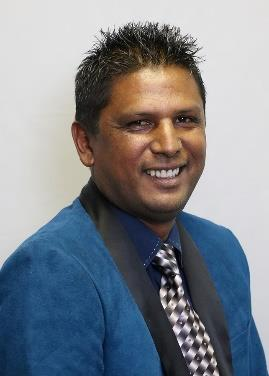

# Foreword by the Executive Mayor

<figure><figcaption></figcaption></figure>

I am honoured to be the Executive Mayor of Bergrivier Municipality and proud to present the Fifth Generation Integrated Development Plan (IDP) for the period 2022 – 2027. According to the Western Cape Government Regional Socio-Economic Profile (SEP 2022) Bergrivier Municipality caters for an estimated 75 484 people which equates to 18 497 households. In spite of our daunting economic challenges our modus operandi has always been based on openness and equality as is evident by the basic service delivery accessibility figures:

* Water 99.3%
* Refuse removal 77.7% (22.3%: agricultural land and Moravian Church property)
* Electricity 96.4%
* Sanitation 96.9%
* Housing 95.1%

Our IDP is built on the strengths of the preceding ones, it is externally focussed and driven by community needs. In order to uphold our vision: Bergrivier - A prosperous community where all want to live, work, learn and play in a dignified manner; we have once again refined our strategic goals and objectives to continue making the biggest possible impact on economic and social development while we endeavour to strengthen relationships and the sense of solidarity among our community for the next 5 years.

**Strategic goal:** Strengthen financial sustainability

| Strategic objectives                                                                                                 |
| -------------------------------------------------------------------------------------------------------------------- |
| To budget strategically                                                                                              |
| Entrench the Long-Term Financial Plan in the planning, implementation and management of the organisation             |
| Diversify revenue and ensure value for money services                                                                |
| Ensure sustainable financial risk and asset management                                                               |
| Diversify by sourcing grant funding to support projects, programmes and initiatives of Council                       |
| Ensure transparency in financial management by ensuring that all financial records are accurate, reliable and timely |

**Strategic goal:** Ensure good governance

|                                                                              |
| ---------------------------------------------------------------------------- |
| Create an efficient, effective, economic and accountable administration.     |
| Provide a transparent and corruption free municipality.                      |
| Accountable leadership supported by professional and skilled administration. |
| Communicate effectively with the public                                      |
| A customer centred approach to everything.                                   |
