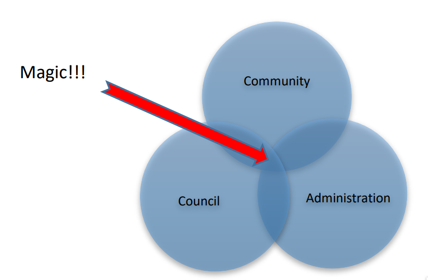

# Foreword by the Municipal Manager

I am very proud to present you with the Fifth Generation (2022 - 2027) Integrated Development Plan (IDP) of Bergrivier Municipality. Our focus is to ensure Bergrivier Municipality works for the poorest of the poor so that all communities within our municipal area may prosper and live in a dignified manner.

This IDP is user-friendly and for the benefit of all our communities. We based our strategic planning on indepth research on the current situation and we would like to thank our colleagues from Provincial Government for collating reliable updated statistics that formed the baseline in profiling the Bergrivier community. We appreciate their support and expertise. We had extensive public participation to acknowledge and understand the real developmental needs in our communities and used the information collated to inform our strategic direction, planning and budget.

Bergrivier Municipality is proud to be known for our innovative partnerships with different stakeholders to really ensure maximum co-operation and focused, seamless development throughout our area. We are committed to continuing to work seamlessly with Provincial and National Government to improve the lives of our citizens. We align our strategic plans with the National Development Plan 2030 (NDP) and the Provincial Strategic Plan (2019 – 2024).

Following this, I truly feel that we epitomise the working partnership between the community, municipal council and administration as envisaged by the Local Government Systems Act and which is depicted below:

<figure><figcaption></figcaption></figure>

Our partnership has gone from strength to strength, and I would like to express my sincerest gratitude to all our partners for the energy and dedication that they expend on working with us to make this partnership a success. It is only through working together that we can ensure the sustainable development of our municipal area and we look forward to more joint planning and implementation in the future. We are truly better together. During the next few years, we will focus on the sustainable development goals (SDG’s) and implementing sustainable solutions throughout our communities.

Our logo **“We serve with pride”** indicates that we are proud to be part of your lives and that we want to work humbly together to serve all our communities and deliver services in a manner that shows that we are proud to be a part of Bergrivier Municipality. We stand by our **vision**: _“Bergrivier! A prosperous community where all want to live, work, learn and play in a dignified manner.”_
