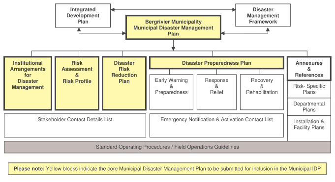
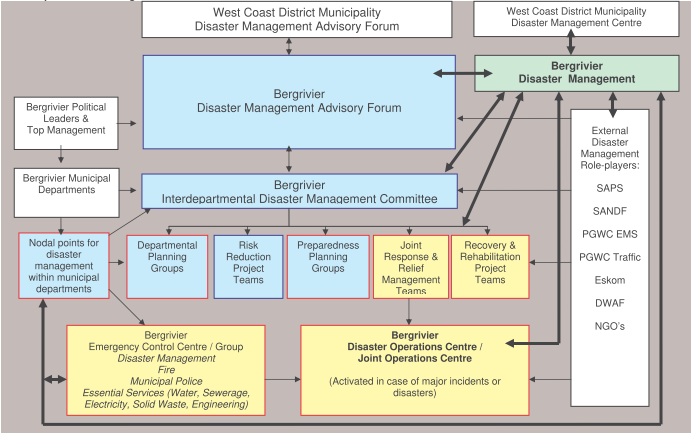

# Disaster Management Plan

* **INTRODUCTION**

The Municipal Council adopted a Disaster Management Plan (DMP) for the Municipality in 2008. In terms of Section 53(c) of the Disaster Management Act No 57 of 2002 the plan must be reviewed and updated regularly. The Bergrivier Municipal Disaster Plan was approved on 17 July 2015 by the Mayoral Committee. The current Disaster Management Plan has been reviewed in May 2016 and is available on request. The DM Plan was again revised during the 2019/20 financial year.

The Disaster Management Act is a legal instrument that provides coherent and transparent information that aims to reduce, minimise and prevent disasters through risk assessment and mitigation strategies. The DMP gives priority to development measures that reduce the vulnerability of disaster-prone areas, communities, agriculture and infrastructure. It also promotes disaster management training and community awareness to reduce the vulnerability of communities at risk.

* **LEGAL FRAMEWORK**

Section 53(1)(a) of the Disaster Management Act requires the Municipality to prepare a risk assessment for its area according to the circumstances prevailing in the area and within the Municipal Disaster Management Framework of the West Coast District Municipality. The Bergrivier DMP must also co- ordinate and align with DMP’s of other organs of state. The Municipality must also consult the Community on the preparation or amendment of its DMP.

Section 53(2)(a) of the Disaster Management Act specifies that the DMP must form an integral part of the municipality’s IDP and Section 26 (g) of the Municipal Systems Act No 32 of 2000 lists “applicable disaster management plans” as core components of an IDP. It would not be practical to include the complete Disaster Management Plan with all its annexure within the IDP, hence the summary.

* **AIM**

The aim of the DMP is to outline a plan of action for the efficient deployment and co-ordination of municipal services, role players and personnel to provide the earliest possible response to a disaster to:

1. Protect and preserve life and property;
2. Minimize the effects of the emergency or disaster on the Bergrivier Municipality;
3. Restore essential services.

* **PURPOSE**

The DMP is designed to establish the framework for implementation of the provisions of the Disaster Management Act as well as the related provisions of the Municipal Systems Act, 2000. The purpose of the plan is to outline policy and procedures for both proactive disaster prevention and reactive disaster response and mitigation. This plan confirms arrangements for managing disaster risks and for preparing for and responding to disasters within the Bergrivier Municipality as required by the Disaster Management Act.

* **LINKAGE WITH THE INTEGRATED DEVELOPMENT PLAN OF BERGRIVIER LOCAL MUNICIPALITY**

Both the Municipal Systems Act and the Disaster Management Act require the inclusion of the DMP into the IDP of the Bergrivier Municipality. A separate disaster management plan included in the IDP does not necessarily give evidence of the integration of disaster management into the IDP. All departments and role players submitting input to the content of the IDP must continuously consider the inclusion and integration of disaster risk management into strategies, operational planning and project implementation. Disaster and risk management must also be taken cognisance of in the planning and execution stages of all IDP projects. This will ensure the integration of disaster management into the IDP and will ensure that all plans and projects are focused on contributing to disaster risk reduction and disaster preparedness – thus reducing the impact of disasters on lives, property, community activities, the economy and the environment.

* **LINKAGE WITH THE DISASTER MANAGEMENT FRAMEWORK OF THE WEST COAST DISTRICT MUNICIPALITY**

The Bergrivier Local Municipality must prepare and execute its disaster management plan within the Disaster Management Framework of the West Coast District Municipality. One of the key performance indicators of the Disaster Management Framework of the West Coast District Municipality is the drafting of detailed Disaster Management Plans by the local municipalities in the District.

* **STRUCTURE OF THE PLAN**

The Municipal Disaster Management Plan of the Bergrivier Local Municipality comprises the components indicated in the figure below.

<figure><figcaption>
FIGURE 13: COMPONENTS OF THE DISASTER MANAGEMENT PLAN
</figcaption></figure>

**RISK ASSESSMENT**

The following disaster risks were identified during a risk assessment process conducted throughout the West Coast District, including Bergrivier Municipality:

| RISKS REQUIRING RISK REDUCTION PLANS                                                                                    | RISKS REQUIRING RISK PREPAREDNESS (CONTINGENCY) PLANS                                                                                                                                                                                                                                                                                                                                                                                    |
| ----------------------------------------------------------------------------------------------------------------------- | ---------------------------------------------------------------------------------------------------------------------------------------------------------------------------------------------------------------------------------------------------------------------------------------------------------------------------------------------------------------------------------------------------------------------------------------- |
| <ul><li>Fire</li><li>Drought</li><li>Road accidents</li><li>Wind</li><li>HIV/Aids</li><li>TB</li><li>Covid 19</li></ul> | <ul><li>Fire</li><li>Drought</li><li>Floods</li><li>Storms</li><li>Wind</li><li>Diseases</li><li>Food</li><li>Poisoning</li><li>Red tide</li><li>Aircraft crash</li><li>Storm surges</li><li>Hazardous installations</li><li>Road accidents</li><li>Hazmat incidents – Road, sea and rail</li><li>Air pollution</li><li>Water pollution</li><li>Land degradation</li><li>Deforestation</li><li>Desertification</li><li>Tornado</li></ul> |

A combined Risk Preparedness (Contingency) plan that addresses all the above was approved as part of the DMP.

Hazards that pose significant threats of disaster to local communities, the region and the country were identified. These are the types of disasters that could potentially occur within the Municipal Area. The list below describes these hazards and proposes mitigating measures.

<table data-card-size="large" data-view="cards"><thead><tr><th>HAZARD</th><th>DESCRIPTION</th></tr></thead><tbody><tr><td>Fire</td><td>The risk of fires, particularly in the dry season is prevalent throughout the Municipal area. The establishment and staffing of a fire station in Piketberg and the implementation of public awareness initiatives are essential. The establishment of a fire station has been initiated in conjunction with the West Coast District Municipality and a mutual aid agreement concluded for the Fire Fighting function. Bergrivier Municipality is presently in the process of appointing of a Chief Fire Officer.</td></tr><tr><td>Drought and water supplies</td><td>Drought risk is significant throughout the region, particularly in the Sandveld and Coastal areas. The water level in the ground water aquifers has dropped substantially in recent years and in some instances, boreholes are no longer productive. Water quality has also declined. In the long term, alternative, sustainable water supplies to the Sandveld and coastal areas are needed. This can be achieved either by desalination plants on the coast or by increasing the capacity of Clanwilliam dam and installing a pipeline to the relevant areas. To limit the current shortages, immediate implementation of a monitoring and control system for the existing boreholes is needed.</td></tr><tr><td>Severe weather (storms, wind, rain)</td><td>During periods of heavy rainfall in the catchment areas, several low-lying areas become inundated. Establishment of the 1:50 and 1:100-year flood-lines along rivers is imperative.</td></tr><tr><td>Hazardous materials inci-dents (esp. road accidents)</td><td>The state of the N7 and the currently unmonitored transportation of hazardous materials create a risk of accidents and exposure to contamination. Implementation of co-operative monitoring of heavy vehicle movements and load identification between the neighbouring traffic authorities is needed to reduce the risk of accidents and spillage. The upgrading of the N7 has just been completed and the road is now at a level that is conducive to the traffic it carries.</td></tr><tr><td>Red Tides</td><td>The annual phenomenon of rapid increase in the concentration of phytoplankton in the water along the coast results, at times, in the crayfish leaving the water in vast numbers and impacts on the fishing industry.</td></tr><tr><td>Power Outages</td><td>The problems experienced by Eskom and the projected inability to meet future demands indicate that power outages are likely to occur on an on-going basis. It is therefore imperative that emergency power facilities are put in place to maintain essential services. These include water and sewage treatment facilities.</td></tr><tr><td>Chronic Disaster</td><td>
Chronic conditions relating to, inter alia, primary health, disease, unemployment, poverty, HIV/Aids, TB and substance abuse are of major social consequence. The situation in the country

as a whole and in the Western Cape is well documented. Community and local government- driven initiatives are needed to improve and maintain public awareness and to alter mind-sets

with respect to responsible medication. Job creation and self-help initiatives will need to be financed and managed.
</td></tr></tbody></table>

* **RISK REDUCTION PLANS AND CAPACITY**

Risk reduction plans that make provision for prevention and mitigation strategies have been compiled through a participative process but have not been vetted or submitted to feasibility studies. The risk reduction plans outlined in the DMP and its annexures which are implementable must be considered for inclusion within the IDP projects of the Municipality, and if included must be budgeted for in terms of the operating and capital budgets of the Municipality. Each project should be evaluated to determine which Municipal Department should lead its implementation. Where the proposed project falls outside the mandate of the Municipality, the Municipality should establish a lobbying and monitoring mechanism to motivate the need for the project through the correct governmental or societal sector and track progress on the project. It is anticipated that many projects will need to be executed on a partnership level, and in such cases the Municipal Department responsible for service delivery partnerships should take the lead with support from Bergrivier Disaster Management.

The organizational structure for risk reduction within the Municipality includes Bergrivier Disaster Management, the Disaster Management Advisory Forum, the Interdepartmental Disaster Management Committee, Departmental Nodal Points, Departmental Planning Groups, Risk Reduction Project Teams and Preparedness Planning Groups. The Municipality must be committed to disaster risk reduction in its entirety. On-going capacity building programmes will be required to ensure the availability of adequate capacity for risk reduction.

* **EARLY WARNING SYSTEMS**

Early warning of disasters is co-ordinated through the West Coast District Municipality Disaster Management Centre. The South African Weather Services (SAWS) regularly forward early warning signs to the Municipality.

* **INSTITUTIONAL ARRANGEMENTS**

&#x20;  o **Shared responsibility for Disaster Management**

The responsibility for reducing disaster risks, preparing for disasters, and responding to disasters is shared among all departments and employees of the Bergrivier Municipality, all departments and employees of the West Coast District Municipality with service delivery responsibilities within the Bergrivier Municipality, all Provincial and National Departments and Agencies operating within the Municipality, all sectors of society within the Municipality and, most importantly, all the residents of the Municipality.

&#x20;   o **Nodal points for Disaster Management**

Disaster risk management is everybody’s responsibility, and each Municipal Department must assign a person or section to be the nodal point for Disaster Management activities in that Department. The same applies to National and Provincial Departments and Agencies operating within the Municipality.

&#x20;  o **Departments with primary responsibility for specific hazards and disaster risks**

Where a Department has primary responsibility for a specific hazard, the Department’s role in disaster risk management for that specific hazard will be more than mere participation. It will be required to lead risk reduction as well as preparedness activities due to its expertise in the field.

&#x20;  o **Assignment of responsibility to deal with specific disaster risks.**

Departments that are responsible for specific services in normal conditions will remain responsible for such services during disasters. The declaration of a state of disaster and the tighter co-ordination instituted during disasters does not absolve any agency of its assigned responsibilities. The DMP and legislation assigns responsibility for most disaster risks to specific departments or functions.

&#x20;  o **Corporate Disaster Risk Management Structure for Bergrivier Municipality**

The corporate disaster management structure for Bergrivier municipality must deal with both pro-active and reactive disaster management issues and encompasses more than the Department which is responsible for the function.

<figure><figcaption>
FIGURE 14: CORPORATE DISASTER RISK MANAGEMENT STRUCTURE
</figcaption></figure>

The corporate structure includes the following elements:

* **Bergrivier Disaster Management**

The Disaster Management Section of Bergrivier Municipality must aim to prevent or reduce the risk of disasters, mitigate the severity or consequences of disasters, prepare for emergencies, respond rapidly and effectively to disasters and implement post-disaster recovery and rehabilitation within the Municipality by monitoring, integrating, coordinating and directing the disaster risk management activities of all role players. The slogan “Disaster Management is everybody’s business” will be the core principle in each of the Departments of Bergrivier Municipality. The management structure will plan to maintain existing services and to adapt and deal with the changed circumstances during major incidents or disasters.

* **Municipal Disaster Management Advisory Forum**

The Head Disaster Management attend quarterly the District Advisory Forum as stated in Section 51 of the Disaster Management Act.

* **Interdepartmental Disaster Management Committee**

This is an internal co-ordination forum at management level where instructions from the Advisory Forum can be implemented and tracked. It also serves as a co-ordination forum for disaster management issues within the Municipality. This role can be performed by the top management team of the Municipality, thus reducing the complexity of the disaster management structure.

* **Departmental Planning Groups**

Departmental Planning Groups should be established to deal with internal disaster management issues such as the compilation of departmental disaster management plans and contingency plans for facilities and services of the department. The Departmental disaster management nodal points of such Departments will be involved in these planning groups.

* **Risk Reduction Project Teams**

A multi-disciplinary project team should be convened to address and reduce specific disaster risks. These project teams can also be convened to address specific risk-mitigation issues during the post-disaster recovery and rehabilitation phase or the pre-disaster risk reduction and preparedness phase. Such Teams will determine their own terms of reference and deliverables in consultation with the Disaster Management Committee (DMC), and will be responsible for planning, managing and completing multi-disciplinary projects. Project teams under line functions can be convened to take responsibility for activities that address the casual factors of a disaster/incident. Such teams will receive a brief from and report back to the Disaster Manager, and work in close co-operation with the DMC.

* **Preparedness Planning Groups**

This is a multi-disciplinary planning group convened to ensure a high level of preparedness for a specific disaster risk, convened by the primary role-player for the risk and supported by Disaster Management.

* **Joint Response & Relief Management Teams**

Mostly flowing from a preparedness planning group, a team that is mobilized to deal with the immediate response and relief required during or immediately after major incidents and disasters.

* **Recovery & Rehabilitation Project Teams**

These are project teams managing recovery and rehabilitation after disasters. Departments who are responsible for the maintenance of specific infrastructure are also responsible for the repair or replacement of such infrastructure after disasters. Disaster recovery and rehabilitation must focus on risk elimination or mitigation.

* **Bergrivier Emergency Control Centre/Group**

This is the centre or group providing 24-hour emergency standby that is responsible for day-to-day emergency responses by Municipal Departments and the establishment of strategic communication links.

* **Bergrivier Joint Operations Centre (JOC)**

This is a facility equipped to serve as command and coordination centre during disasters, where the Joint Response & Relief Management Team will convene. Alternative facilities should be identified as back-up to the primary JOC. The JOC/ECC team will be responsible to assess, evaluate and co-ordinate all actions in all phases of the incident. Each line function will be responsible for the implementation of its own departmental disaster plan, but the JOC/ECC team will ensure coordination and support between Municipal Departments and external bodies. The Joint Operational Centre/Emergency Control Centre will consist of the following:

| INTERNAL                                                                                                                                                                                                                                                                                                      | EXTERNAL BODIES                                                                                                                                                                                 |
| ------------------------------------------------------------------------------------------------------------------------------------------------------------------------------------------------------------------------------------------------------------------------------------------------------------- | ----------------------------------------------------------------------------------------------------------------------------------------------------------------------------------------------- |
| <ul><li>Municipal Manager</li><li>Director: Technical Services</li><li>Director: Corporate Services</li><li>Director: Financial Services</li><li>Director Community Services</li><li>Manager: Planning and Development</li><li>Chief Fire Officer (Head: Disaster Management)</li><li>Chief Traffic</li></ul> | <ul><li>West Coast Disaster Management Centre</li><li>Emergency Medical Services</li><li>SAPS</li><li>Governmental departments</li><li> Representatives from other bodies as required</li></ul> |
