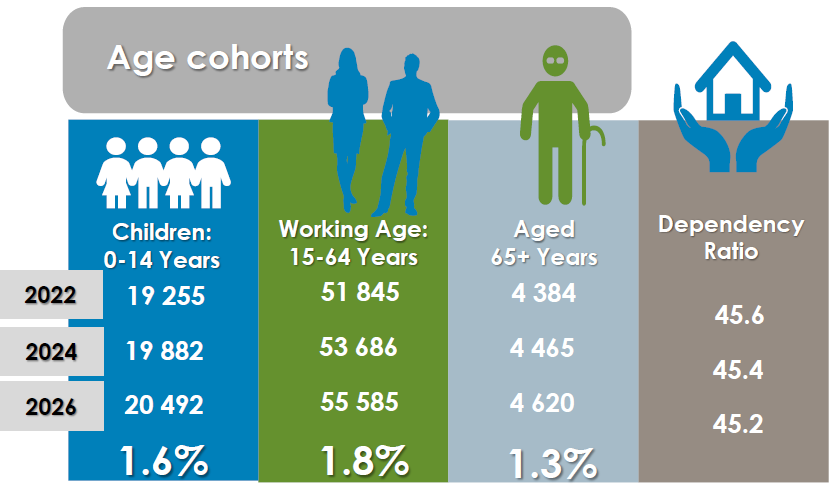

# Demographic Profile

Demographics is broadly defined as the study of population dynamics that include number of people living in an area, number of households, birth and death rates, migration patterns, age, race, gender and life expectancy. It is important to understand the profile of a community as it forms the basis of the socio-economic reality of the area.

Various sources of statistics have been used as the statistics of 2011 conducted by Statistics South Africa is outdated. Where statistics have not been available for specific aspects, StatsSA is still used. The sources are predominantly the MERO (Municipal Economic Review Outlook)-2022-report, the Social Economic Profile (SEP) compiled by the Western Cape Government and various other resource material such as IHS Markit. In general, the use of official data/statistics is always preferred. However, in most countries and especially developing countries including South Africa data/statistics on a local or sub-national level is very limited. On the other hand, the demand for such local or sub-national level data/statistics has been increasing dramatically. This demand/supply imbalance created a vacuum that several private sector actors started exploiting. To this end several local or sub-national level data/statistics are now available as supplied by private sector institutions. However, these are deemed non-official since these datasets are not sanctioned by the National Statistics Office. This by no means should detract from the credibility and/or reliability of these datasets. Not being deemed official does not necessarily suggest that the datasets should not be used. It can be argued that given the wide use of the datasets there is value in using the datasets. It must also be stated that these private institutions have taken great care in their methodologies and do make use of best-practice methodologies. Analyzing and working with the datasets also points to credibility and reliability. The datasets are also frequently updated and modified further enhancing credibility and reliability. In essence, the use of official and non-official datasets as compliments should yield very useful information.

The purpose of this section is therefore to provide statistics of Bergrivier Municipality as to develop a holistic profile of the municipal area.

## Population

_i.  South African population_

According to the Statistics South Africa (StatsSA) Mid-Year Population Estimate publication (released on 19 July 2021), the total estimated population count for South Africa (SA) was 60 142 978 in 2021 and is projected to increase to 67 266 090 in 2031. This translates an increase of around 7 million people over a 10-year period.

_ii.  Western Cape Population_

The same publication estimates the total population count for the Western Cape Province at 7 113 776 in 2021. StatsSA estimates the total population count for the Province at 8 306 701 in 2031. This translates into a 1.2 million population increase for the Province over the 10-year period.

_iii.  West Coast District Population_

Based on the StatsSA Mid-Year Population estimate, the West Coast total population count was 476 020 in 2022 and is projected to total 510 129 in 2026. This represents an increase of 34 109 from 2022 to 2026.

The below figure displays the estimated population counts per West Coast District Local Municipality from 2002 to 2031. It is evident that the Swartland Municipality has been and will continue to be the most populated Municipality in the West Coast District, while the Cederberg Municipality was and will continue to be the least populated Municipality in the District. However, it is noticeable that the Matzikama and Bergrivier Municipalities swapped places in terms of population counts during 2018/2019 and it is likely that the Matzikama Municipality will also swap places with the Cederberg Municipality post 2031.

<figure><figcaption>
<em>Figure 4: Estimated Population Count For West Coast District.</em> IHS MARKIT
</figcaption></figure>

The below figure displays the estimated household counts per West Coast District Local Municipality from 2002 to 2031. It is evident that the Saldanha Bay Municipality has been (post 2010) and will continue to accommodate the most households per Municipality in the West Coast District, while the Cederberg Municipality was and will continue to accommodate the least households per Municipality in the District.

<figure><figcaption>
IHS MARKIT
</figcaption></figure>

The below table displays estimated summary statistics for each of the West Coast District Local Municipalities for the period 2002 to 2031.

<table data-card-size="large" data-view="cards"><thead><tr><th>%</th><th>MATZIKAMA</th><th>CEDERBERG</th><th>BERGRIVIER</th><th>SALDANHA BAY</th><th>SWARTLAND</th></tr></thead><tbody><tr><td>Average Household Contribution</td><td>16.32</td><td>12.87</td><td>15.89</td><td>25.92</td><td>29.01</td></tr><tr><td>Average Population Contribution</td><td>16.44</td><td>12.99</td><td>15.61</td><td>28.30</td><td>26.67</td></tr><tr><td>Average Population Growth Rate</td><td>0.84</td><td>1.74</td><td>1.87</td><td>2.21</td><td>2.28</td></tr><tr><td>Average Household Growth Rate</td><td>1.02</td><td>2.02</td><td>2.03</td><td>3.23</td><td>2.28</td></tr></tbody></table>

MERO 2022

The figure below displays estimated household size (population per household) for each of the West Coast District Local Municipalities for the period 2002 to 2031. The estimated household size in the Saldanha Bay municipality decreases significantly over the period, while it stays relatively constant in the Swartland Municipality.

<figure><figcaption>
IHS MARKIT
</figcaption></figure>

The below figure displays estimated population density (population per km2) for each of the West Coast District Local Municipalities for the period 2002 to 2031. The Saldanha Bay Municipality was and will continue to be to most populated Municipality, while the Matzikama Municipality was and will continue to be the least populated Municipality in the West Coast District. There are significant disparities between the Municipalities as evident in the figure.

<figure><figcaption>
IHS MARKIT
</figcaption></figure>

The below figure displays estimated average population age (in the age cohort 25-29) for each of the West Coast District Local Municipalities for the period 2002 to 2031. The bars present the contribution (%) of the population count between 25 and 29 of the total population count for each Municipality for the indicated period. It proposes that the average age in the Matzikama Municipality has and will stay constant at around 27, while the average age in the other 4 Municipalities have and will increase relative consistently over the period from around 27 to 32, i.e., aging of the population. The data also proposes that the average population age is the highest in the Bergrivier Municipality reaching around 35 in 2031.

<figure><figcaption>
IHS MARKIT
</figcaption></figure>

It is important to list the collective major areas of concern in the West Coast as to contextualise the major challenges of Bergrivier. These major areas of concern for the whole of the West Coast District include:

* Rising population and poor households;
* Households with no income;
* High unemployment rate and in-migration;
* Cost of housing;
* Informal dwellers;
* Teenage pregnancies;
* ART and TB patient loads;
* Lower immunisation coverage;
* Sustainability of service levels;
* Shortage of relevant and appropriate human resource;
* Water & other resources, including funding;
* Increasing cost and unaffordability of basic services; and
* Climate change and effect on agriculture.

_iv.  Bergrivier Municipality Population_

_Population statistics_

According to the 2021 StatsSA Mid-Year Population, 75 484 people were residing within the Bergrivier Municipal Area in 2022 with a projection of 80 697 in 2026. The Municipality was home to around 18 497 households in 2022 with a projection of 23 689 in 2031. The average household size in the Municipality is projected to decrease from 3.92 in 2022 to 3.70 in 2031. The average population density in the Municipality is projected to increase from around 16.8 people per km2 in 2022 to 19.9 people per km2 in 2031. Bergrivier Municipal Area is the 2nd least populated municipal area in the West Coast District. It has the 2nd highest household size and the 3rd highest population density in the West Coast District.

_Population per town_

The following table indicates the population dispersion by and projection per town / area:

<figure><figcaption></figcaption></figure>

The population counts were estimated based on a structured disaggregated population model that uses StatsSA Mid-Year Population estimates, WordPop gridded population estimates and the United Nations (UN) World Prospects, 2019. The spatial distribution of the Bergrivier Municipality is displayed in the below figure:

<figure><figcaption>
IHS MARKIT
</figcaption></figure>

_Population statistics per gender_

According to the 2021-SEP, the population per gender is as follows:

<figure><figcaption>
SEP 2022
</figcaption></figure>

The gender composition remained relatively unchanged and well balanced, with a slightly higher ratio of females to males. The increasing gender ratio could be attributed to a wide range of factors including an increase in female mortality rates and the potential inflow of working males into the municipal area.

<figure><figcaption></figcaption></figure>

<figure><figcaption>
SEP 2022
</figcaption></figure>

_Population statistics per age_

According to the 2022 SEP, the Age Cohorts can be outlined as follows:

<figure><figcaption>
SEP 2022
</figcaption></figure>

Between 2022 and 2026, the highest projected population growth isrecorded for the working age population (15-65years) , projected to grow at an annual average rate of 1.8 %. The children (0-14 years) age cohort is also predicted to grow relatively fast, at an average annual rate of 1.6 % over the same period. The aged (65 years and older) cohort, is the slowest growing age cohort in the area, growing at a rate of 1.3 % for the same period. These predicted growth rates will Llad to a decline in the dependency ratio, from 45.6 in 2022 to 45.2 in 2026.

_Population statistics per race_

The racial composition between 1996 and 2020 is as follows:

| DATE | AFRICAN | WHITE  | COLOURED | ASIAN |
| ---- | ------- | ------ | -------- | ----- |
| 2015 | 9,429   | 10,916 | 47,330   | 333   |
| 2016 | 9,949   | 10,929 | 48,109   | 351   |
| 2017 | 10,444  | 10,942 | 48,885   | 368   |
| 2018 | 10,923  | 10,948 | 49,649   | 384   |
| 2019 | 11,391  | 10,945 | 50,381   | 400   |
| 2020 | 11,391  | 10,941 | 51,099   | 414   |

&#x20;                                                               IHS MARKIT

Language dispersion

The following table provides an estimate of the language dispersion in the Bergrivier Municipal Area:

<figure><figcaption>
IHS MARKIT
</figcaption></figure>

## Households

_Number of households_

<figure><figcaption>
SEP 2022
</figcaption></figure>

Basic service delivery should be informed by credible and accurate number of households within a municipal area. There are 18 462 households in the Bergrivier Municipal Area (SEP 2021) with 123 836 households in the West Coast District in 2021. The total households include the entire municipal area inclusive of private farms and/or land.

_Household size_

Minimal change in household size is expected between 2021 and 2031 in the Bergrivier Municipal Area with the actual size of households estimated to remain at 3.9 persons per household. It is expected to drop to 3.7 persons per household in 2031.

<figure><figcaption>
SEP 2022
</figcaption></figure>
