# Social Profile

## EDUCATION

Education is the functional mandate of the Department of Education, but the impact of shortcomings within the education system and the lack of skills impact on the Municipality. The Municipality therefore has a vested interest in working co-operatively with the Department of Education and related departments whose functional mandates fall within the realm of social development.

Skills are an essential contributor to the development of individuals, businesses, societies and economies. Their importance is even more pronounced in the South African context where high levels of structural unemployment among the youth is still more prevalent than in other emerging economies. While low skill levels and lack of experience are widely known as the primary causes of unemployment amongst youth, it is also becoming increasingly apparent that many young graduates are unable to find employment due to an education system that is supplying industry with skills that are either inadequate or irrelevant. Globally, apprenticeship-based learning remains the most effective learning methodology that produces high quality workers that have the skills that employers need. The Labour Force Surveys released by Stats SA on a quarterly basis reveal that the unemployment rate among youth (aged 15-34 years) is consistently higher than the adult unemployment rate in all provinces.

It is estimated that approximately half a million jobs remain vacant because of a lack of the appropriate skills. These shortages are felt particularly in the fields of maths and science, with a lack of skills in fields such as engineering and ICT as well as a growing shortage of vocational and technical skills (artisans) such as electricians, welders and mechanics, which is seriously hampering economic growth. The national scarce skills list released by national government reveals that 18 of the top 31 scarce skills in the country fall within the artisan sector. The shortage is set to worsen with the National Development Plan envisaging that the country will need to produce 30 000 qualified artisans a year by 2030, while the current annual production rate is only 13 000 – and just under 1 000 in 2015 in the Western Cape.

There are several reasons for these shortages, which include:

* Poor maths and science pass rates at schools;
* Lack of awareness of scarce skills and related employment opportunities;
* Learners preferring to enrol at universities, which they view as superior to technical colleges;
* Negative societal perceptions of the status of artisans; and
* A shortage of funding and workplace-based learning opportunities.

Education and skills will improve access to available employment opportunities. The low education and skills levels of the Bergrivier Community are contributing to unemployment and poverty and are cause for concern. Education and training opportunities are limited by the absence of any tertiary (or technical) education facilities in the Municipal Area. Bergrivier is the only Municipality in the West Coast District without a FET College. This is evidenced by the fact that only 6 % of school leavers have some form of tertiary education. The following Educational indicators for Bergrivier Municipal Area provide a dashboard overview of the status quo of education in the area:

_Educational facilities_

<figure>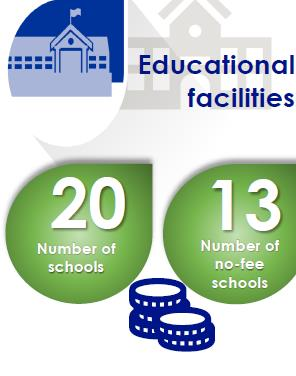<figcaption>
SEP 2022
</figcaption></figure>

The number of schools (total of 20 public ordinary schools) has remained unchanged over the last few years. The number of no-fee schools also remained constant at 13 which represent 65 % of schools being registered with the Western Cape Department of Education.

The number of schools with libraries decreased from 12 (2018) to 10 (2019) to 8 in 2020. There is therefore a considerable scope for the extension of libraries to other schools in the area.

_Learner enrolment_

<figure>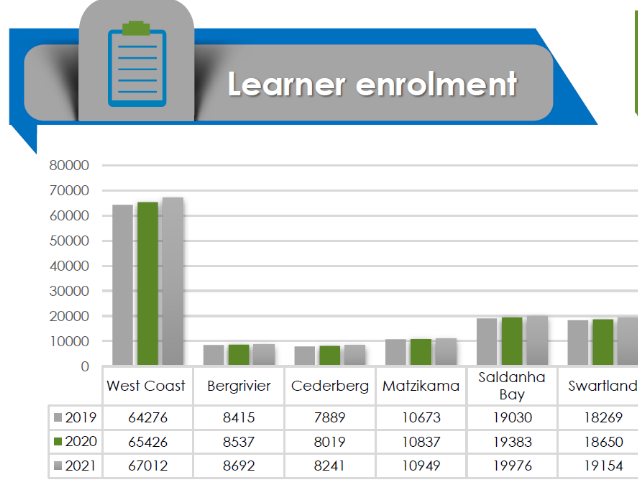<figcaption></figcaption></figure>

<figure>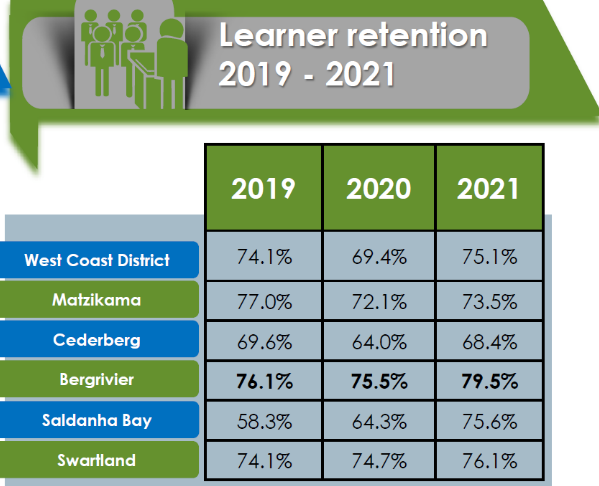<figcaption>
SEP 2022
</figcaption></figure>

In 2021, a total of 8 692 learners were enrolled within the Bergrivier area, marginally more than the 8 537 enrolled in 2020.

With a learner retention rate (Grade 10 to 12) of 75.1 % (2021) for the West Coast District area, learner retention remains a critical challenge across the District. Although the Bergrivier area has the highest retention rate (79.5 %) within the District (2021), it still remains a serious concern. The learner retention rate is influenced by a wide array of factors, including economic influences such as unemployment, poverty/very low household income/ indigent households, as well as social concerns such as teenage pregnancies, overcrowded classrooms, student attitudestowards education, as well as other personal circumstances which can make it difficult for learners to focus on education. Retention rates should be kept in mind when considering education outcomes/results, as low retention rates are likely to skew outcomes, as drop-outs are automatically excluded from any outcomes/results. Being able to retain learners is essential for overall positive education outcomes.

_Learner-teacher ratio_

<figure>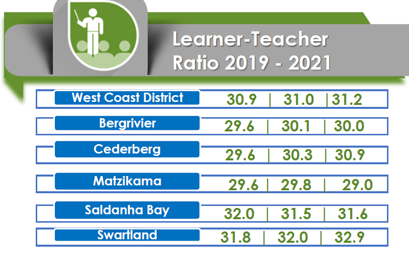<figcaption>
SEP 2022
</figcaption></figure>

The learner-teacher ratio decreased marginally from 30.1 in 2020 to 30.0 in 2021, in line with the recommended norm of up to 40:1 for ordinary primary schools and 35:1 for ordinary high schools as set by the Department of Education.

_Education Outcomes_

<figure>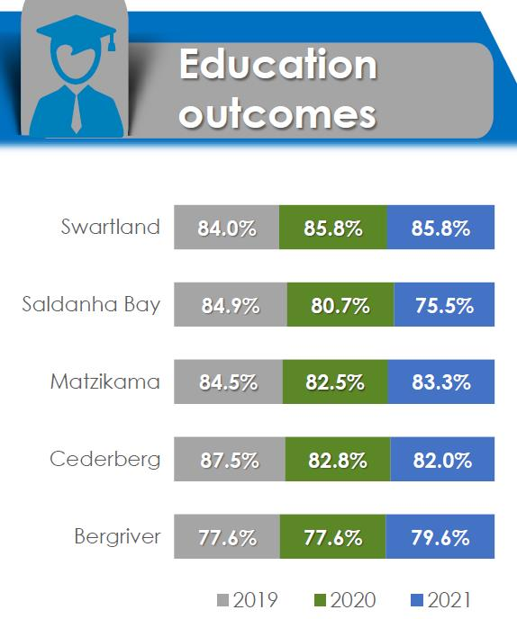<figcaption>
SEP 2022
</figcaption></figure>

In preparing individuals for future engagement in the labour market, policy choices and decisions in the sphere of education play a critical role in determining the extent to which future economic and poverty reduction plans can be realised. The Bergrivier area’s matric pass rate increased slightly from 77.6 % in 2020 to 79.6 in 2021. The Bergrivier matric pass rate is one of the lower rates in the District; however almost on par with the Province’s 80.7 %.

_Literacy rate_

The problem in education and readiness for the employment market is exacerbated by a low literacy rate, which is an indicator of the levels of education and skill in the economy. The literacy rate is calculated as the proportion of persons 14 years and older who have successfully completed a minimum of 7 years of formal education.

According to the Western Cape Government: Provincial Treasury: Municipal Economic Review and Outlook (MERO) 2015, the Municipality’s literacy level was 76.4 % in 2011 which is significantly lower than the Provincial and District norms of 87.2 % and 79.1 % respectively. A positive is that it has increased by 6 % since 2001. Skills development is, in the light of the above problematique, a serious challenge given that the youth is not prepared for the potential employment market. The overall picture in skills development in Bergrivier is discouraging as 55.5 % of the population is considered “low-skilled”.

<figure><figcaption>
SEP 2022
</figcaption></figure>

A significant number of jobsremain vacant because of a lack of the appropriate skills. These shortages are felt particularly in the fields of maths and science, with a lack of skills in fields such as engineering and Information and Communication Technology (ICT), as well as a growing shortage of vocational and technical cvskills (artisans)such as electricians, welders and mechanics, which is seriously hampering economic growth. There are several reasons for these shortages, which include:

* Poor maths and science pass rates at schools;
* Lack of awareness of scarce skills and related employment opportunities;
* Learners preferring to enroll at universities, which they view as superior to technical colleges;
* Negative societal perceptions of the status of artisans;
* A shortage of funding and workplace-based learning opportunities; and
* Lack of schools who present technical programs.

Education and skills will improve access to available employment opportunities. The low education and skills levels of the Bergrivier Community are contributing to unemployment and poverty and are cause for concern. Education and training opportunities are limited by the absence of any tertiary (or technical) education facilities in the Municipal Area. Bergrivier is the only Municipality in the West Coast District&#x20;

Bergrivier Municipality is currently in discussions with the Jakes Gerwel School of Skills in Bonnievale to establish a similar school in Piketberg. The funding and establishment of this model school will be conducted through the Small-Town Regeneration Programme. The Pietie Fredericks Youth Centre in Piketberg will also focus on making the youth ready for the market in terms of employment.

## HEALTH CARE

Good health is vital in achieving and maintaining a high quality of life. The information provided by the Department of Health pertains only to public sector health institutions and it should be acknowledged that health includes factors such as control of diseases, clean water, sanitation and removal of solid waste which falls within the mandate of municipalities.

_Healthcare Facilities_

Bergrivier has a high percentage of households with no access to private healthcare institutions and are dependent on the availability and access to public health care facilities. Health care in South Africa is geared in such a way that people must move from primary, with a referral system, to secondary and tertiary levels. In 2021/22, the Bergrivier area had 3 primary health care facilities, all fixed clinics; there were also 8 mobile/satellite clinics. In addition to these primary healthcare facilities, there are also 2 district hospitals as well as 10 ART clinics/treatment sites and 8 TB clinics/treatment sites.

Critical health issues in the Bergrivier Municipal Area are migration and the influx of seasonal workers which result in a higher burden of diarrhoea and an increase in TB and other infectious diseases.

_Tuberculosis and HIV/Aids_

<figure><figcaption>
SEP 2022
</figcaption></figure>

The total number of registered patients receiving antiretroviral treatment in the Bergrivier region decreased by 24 patients, from 1 418 in 2020/21 to 1 394 in 2021/22. At the same time, the number of new antiretroviral patients was slightly more at 157 in 2021/22 compared with 146 in 2020/21. There has also been an increase of 26 registered patients receiving TB treatment in the Bergrivier Area, from 352 in 2020/21 to 378 in 2021/22.

_Child Health_

<figure>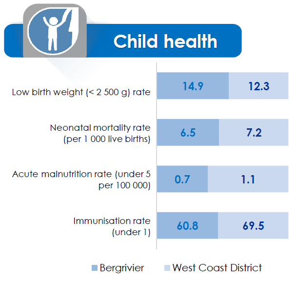<figcaption>
SEP 2022
</figcaption></figure>

The immunisation rate in the Bergrivier area increased marginally, from 59.6 % in 2020/21 to 60.8 % in 2021/22, keeping the rate at well below the ideal level. There was also a worsening in the proportion of malnourished children under five years, from 0.5 (per 100 000people) in 2020/21 to 0.7.

While the low-birth-weight indicator (less than 2 500g) for the Bergrivier area presented a slight improvement, from 15.1 % in 2020/21 to 14.9 % in 2021/22, the neonatal mortality rate (per 1 000 live births) registered more significant improvement, from 14.3 in 2020/21 to 6.5 in 2021/22.

_Maternal Health_

<figure>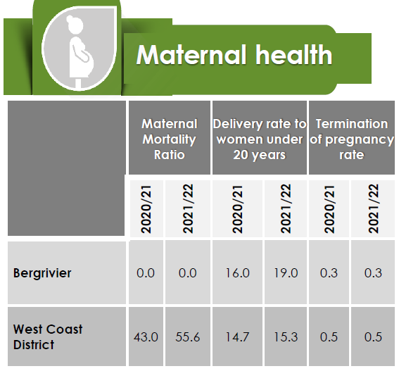<figcaption>
SEP 2022
</figcaption></figure>

When considering maternal health in the Bergrivier area, zero deaths per 100 000 live births were recorded in 2021/22 (maternal mortality rate of zero), same as the previous year. For the period 2020/21 to 2021/22, the delivery rate to women under 20 years increased from 16.0 to 19.0 %, maintaining the highest rate in the District. The termination of pregnancy rate remained unchanged at 0.3 %.

## POVERTY

High poverty levels impact on the well-being of the community and the sustainability of the Municipality as it reduces the ability of people to pay for services and increases dependency on indigent grants which the Municipality finances from its equitable share.

The intensity of poverty and the poverty headcount of municipalities are measured. The intensity of poverty is measured by calculating the Poverty Gap Index which is the average poverty gap in the population as a proportion of the poverty line. The Poverty Gap Index estimates the depth of poverty by considering how far, on the average, the poor are from that poverty line. The Poverty Gap Index is a percentage between 0 and 100 percent. A theoretical value of zero implies that no one in the population is below the poverty line. Individuals whose income is above the poverty line have a gap of zero, while individuals whose income is below the poverty line would have a gap ranging from 1 % to 100 %, (with a theoretical value of 100 % implying that everyone in the population has an income that is below the poverty line or zero). A higher poverty gap index means that poverty is more severe.

_**Poverty Headcount and Intensity:**_

**Share of People Below the Lower Poverty Line**

The lower poverty line is defined by StatsSA as the level of consumption that includes both food and essential non-food items but requires that individuals sacrifice some food items to obtain the non-food items. This variable measures the share of individuals in the selected area that are living below the lower poverty line for the given area and is balanced directly to the official lower bound poverty rate as measured by StatsSA.

| DATE | TOTAL  | PERCENTAGE |
| ---- | ------ | ---------- |
| 2015 | 16 545 | 24,30 %    |
| 2016 | 18 664 | 26,90 %    |
| 2017 | 20 122 | 28,50 %    |
| 2018 | 20 974 | 29,20 %    |
| 2019 | 22 149 | 30,30 %    |
| 2020 | 24 399 | 32,80 %    |

&#x20;                                                                      IHS MARKIT

**Below the Upper Poverty Line**

The upper poverty line is defined by StatsSA as the level of consumption at which individuals can purchase both sufficient food and non-food items without sacrificing one for the other. This variable measures the number of individuals living below that level of consumption for the given area and is balanced directly to the official upper poverty rate as measured by StatsSA.

| DATE | TOTAL  | PERCENTAGE |
| ---- | ------ | ---------- |
| 2014 | 27 141 | 40,70 %    |
| 2015 | 28 377 | 41,70 %    |
| 2016 | 30 412 | 43,90 %    |
| 2017 | 31 780 | 45,00 %    |
| 2018 | 32 692 | 45,50 %    |
| 2019 | 34 022 | 46,50 %    |
| 2020 | 36 363 | 48,90 %    |

&#x20;                                                                         IHS MARKIT

_Household Income_

The annual income for household living in Bergrivier is divided into 3 categories, namely the proportion of people that fall within the low-, middle- and high-income brackets. Poor households fall in the low-income bracket which ranges from no income to R 50 000 annually (R 4 166/ month). Increase in living standards is evidenced then by a rising number of households entering the middle- and high-income brackets. An estimated 49 % of households in Bergrivier fall within the low-income bracket of which 9,4 % have no income. 45 % of the households fall in the middle-income group with 6 % in the higher income group.

<figure><figcaption>
Socio-Economic Profile: WC Provincial Government
</figcaption></figure>

The following table represents the level of monthly income required to meet each of the three StatsSA defined poverty lines. These income levels represent the income required for June of each year.

UPPER BOUND

| 2015 | 992   |
| ---- | ----- |
| 2016 | 1 077 |
| 2017 | 1 138 |
| 2018 | 1 183 |
| 2019 | 1 227 |
| 2020 | 1 268 |

&#x20;                                                                      IHS MARKIT

_GDPR per capita_

An increase in real regional gross domestic product (GDPR) per capita, i.e., GDPR per person is experienced only if the real economic growth rate exceeds the population growth rate. Even though real GDPR per capita reflects changes in the overall well-being of the population, not everyone within an economy will earn the same amount of money as estimated by the real GDPR per capita indicator.

With a per capita GDPR of R 57 486 in 2021, the Bergrivier municipal area remains below that of the District’s R 61 352, as well as the Province’s R 81 650. Within the region, the per capital GDPR ranges from a low of R 52 905 for Matzikama, to a high of R 73 175 for the Saldanha Bay area.

_Income Inequality_

South Africa suffers among the highest levels of inequality in the world when measured by the commonly used Gini index. Inequality manifests itself through a skewed income distribution, unequal access to opportunities, and regional disparities. The National Development Plan (NDP) has set a target of reducing income inequality in South Africa from a Gini coefficient of 0.7 in 2010 to 0.6 by 2030. However, between 2015 and 2021, income inequality in the Bergrivier area worsened, with the Gini-coefficient increasing from 0.56 in 2015 to 0.60 in 2021. Worsening income inequality could also be seen across the District (0.58 in 2015 and 0.61 in 2021) and Province (0.60 in 2015 and 0.62 in 2021) over the same period.

<figure>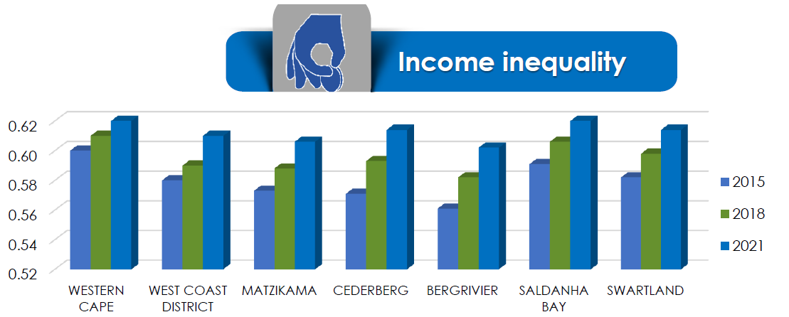<figcaption>
SEP 2022
</figcaption></figure>

_Human Development Index_

HDI (Human Development Index) is a composite indicator reflecting on education levels, health and income. The HDI is represented by a number between 0 and 1, where 1 indicates a high level of human development and 0 represents no human development. There has been a general increase in the HDI for the Bergrivier Municipal Area from 0.67 (2014) to 0.74 (2020). The following is an overview of the HDI in the Bergrivier Municipal Area from 2000 – 2020 showing a slow progress:

WC013 BERGRIVIER – HUMAN DEVELOPMENT INDEX

| 2016 | 0,68 |
| ---- | ---- |
| 2017 | 0,68 |
| 2018 | 0,69 |
| 2019 | 0,69 |
| 2020 | 0,7  |

&#x20;                                                                             IHS MARKIT

_Indigent households_

In response to the poverty levels of its communities, municipalities offer households support through their indigent policy. The indigent policy provides for free or discounted rates on municipal specified services such as water, electricity, sanitation, refuse removal as well as property rates. The following provides an overview of the number of indigents in the West Coast District:

<figure><figcaption>
Department of Local Government 2021
</figcaption></figure>

An important source of statistics is also the number of refuse removal accounts as at the end of the previous financial year. This is a reliable data source as Bergrivier does not have informal townships and each household receive an account for refuse removal. There is a total of 9 876 urban households in the Municipality to which the municipality renders a service to of which 1 920 are poor (indigent). This figure constitutes 19.44 % of the total number of households. Indigent households are defined as households where the combined monthly income of the household is less than the equivalent of two state pensions plus 40 %.

_Food security_

One of the key components of poverty is food security. No official statistics is yet available on households not having food or the frequency of households not having food. It is, however, known that 20 % of South African households have inadequate or severely inadequate food access. More than 14 million people (35 % of South African population) is estimated to be vulnerable to food security and 1,5 million children (25 % of South African children) under the age of 6 is stunted by malnutrition. It has also been found that food insecurity is more prevalent in rural areas and in single mother families.

The following table gives an overview of the number of people suffering from food security over a period. The food poverty line is defined by StatsSA as the level of consumption below which individuals are unable to purchase sufficient food to provide them with an adequate diet. Those below this line are either consuming insufficient calories for their nourishment or must change their consumption patterns from those preferred by low-income households. This variable measures the share of individuals in the selected area that are living below the food poverty line for the given area and is balanced directly to the official food poverty rate as measured by StatsSA.

PEOPLE BELOW THE FOOD POVERTY LINE (STATSSA DEFINED)

| DATE | TOTAL  | PERCENTAGE |
| ---- | ------ | ---------- |
| 2015 | 8 726  | 12,80 %    |
| 2016 | 10 487 | 15,10 %    |
| 2017 | 11 513 | 16,30 %    |
| 2018 | 11 963 | 16,60 %    |
| 2019 | 12 711 | 17,40 %    |
| 2020 | 14 517 | 19,50 %    |

&#x20;                                                                            IHS MARKIT

## SAFETY AND SECURITY

Safety of person and property is upheld in the Constitution and is important to the physical and emotional well-being of people and business. The extent of crime in South Africa impacts on the livelihood of families and affects the economy in general.

_Murder_

<figure>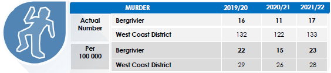<figcaption>
SEP 2022
</figcaption></figure>

Murder is defined as the unlawful and intentional killing of another person. Within the Bergrivier Area, the number of murders increased 11 to 17 between 2020/21 and 2021/22, with the murder rate (per 100 000people) increasing from 15 to 23. The murder rate per 100 000 population is below that of the District’s 28 for the 2021/22year.

_Sexual Offences_

<figure>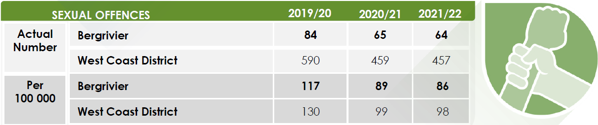<figcaption>
SEP 2022
</figcaption></figure>

Sexual offences include rape (updated to the new definition of rape to provide for the inclusion of male rape), sex work, pornography, public indecency and human trafficking. In 2021/22, there were 64 sexual offences in the Bergrivier Area. When comparing this to the District, the Bergrivier Area’s incidence of sexual offences per 100 000 population was lower that of the District, at 86 compared to the District’s 98.

_Drug-related Crimes_

<figure>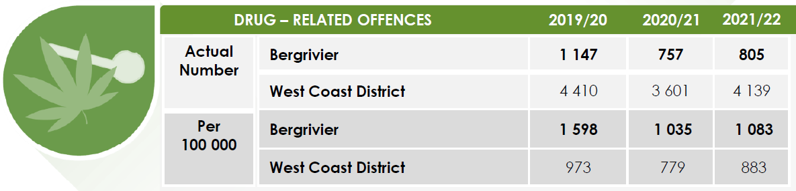<figcaption>
SEP 2022
</figcaption></figure>

Drug-related crimes refer to the situation where the perpetrator is found to be in possession of, under the influence of, orselling illegal drugs. Drug-related crime within the West Coast area increased significantly from 3 601 cases in 2020/21 to 4 139 cases in 2021/22 with the Bergrivier Area following a similar trend, increasing from 757 in 2020/21 to 805 in 2021/22. Bergrivier’ s rate of 1 083 per 100 000 people exceeded that of the District’s 883.

_Driving under the influence_

<figure>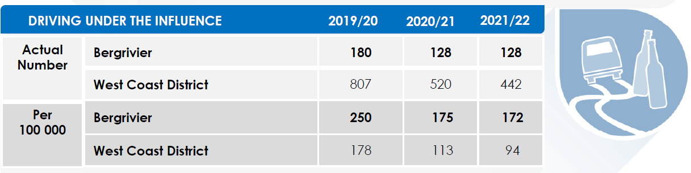<figcaption>
SEP 2022
</figcaption></figure>

A situation where the driver of a vehicle is found to be over the legal blood alcohol limit. The number of cases of driving under the influence of alcohol or drugs in the Bergrivier Area remained the same at 128 in 2020/21 and 2021/22. This translates into a rate of 172 per 100 000 people in 2021/22, which is significantly above the District’s 94 per 100 000 people.

_Residential burglaries_

<figure>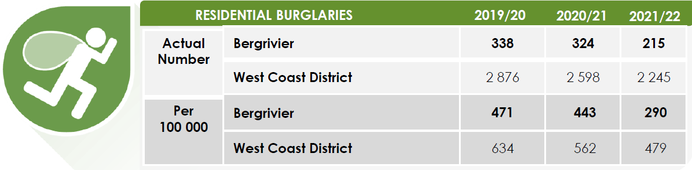<figcaption>
SEP 2022
</figcaption></figure>

The unlawful entry of a residential structure with the intent to commit a crime, usually a theft. The number of residential burglaries in the Bergrivier Area decreased from 324 in 2020/21 to 215 in 2021/22. The Municipal area’s rate of 290 per 100 000 population was well below that of the District’s 479 for 2021/22.
