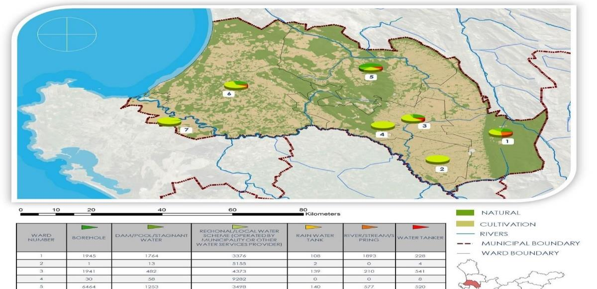
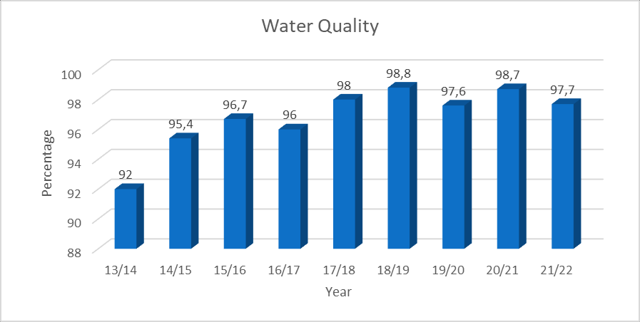
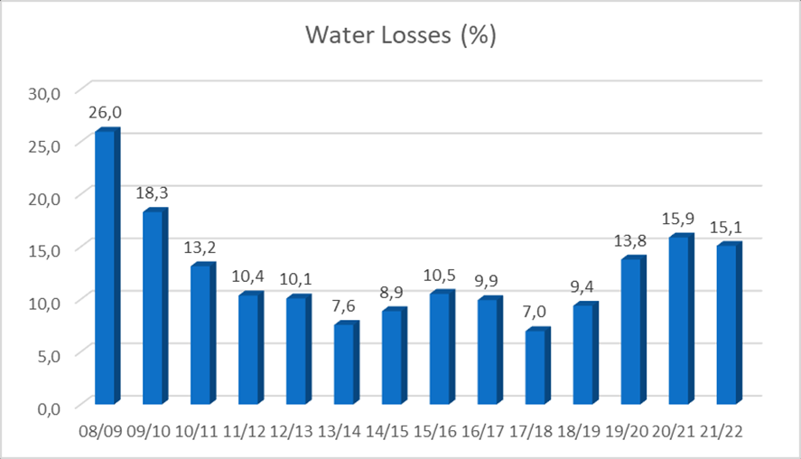

# Status Quo of Bulk Infrastructure and Access to Basic Services

_BULK INFRASTRUCTURE_

The following table is a visual presentation of the bulk capacity constraints in Bergrivier Area (with the following legend:

| Red     | Upgrading needed before 2028         |
| ------- | ------------------------------------ |
| Yellow  | Upgrading needed between 2028 – 2033 |
| Green   | Upgrading needed after 2033          |
| WTW     | Water Treatment Works                |
| WWTW    | Wastewater Treatment Works           |
| Storage | Storage reservoirs for potable water |

<figure><figcaption></figcaption></figure>

<figure><figcaption>
*water source –WCDM Withoogte Scheme and WCWSS (Western Cape Water Supply System)
</figcaption></figure>

The infrastructure with the red faces in the above table indicates urgent attention, the yellow faces need to be upgraded between 2028 and 2033 and the green faces has capacity until 2033. Underneath is the prioritised lists and cost estimates of infrastructure needed. A concern is the huge infrastructure cost versus the funding available to upgrade the infrastructure.

<figure><figcaption></figcaption></figure>

<figure><figcaption></figcaption></figure>

**Access to Basic Services:**

The Municipality is required to provide basic services to its community. Basic services are a package of services necessary for human well-being and typically include water, sanitation, electricity and waste management. To ensure effective and efficient service delivery, Council must make funds available to update all master plans every 5 years to do proper planning for maintenance and replacement of old infrastructure and upgrades for future demands. The Municipality is granted an equitable share which it receives from national government in terms of the Division of Revenue Act (DORA) for the provision of free basic services to households who cannot afford to pay for their services. National policy requires that poor households should receive 50 kWh of free basic electricity, 6 Kl of free basic water, free basic sanitation and free weekly refuse removal.

## WATER

Access to minimum water standards is defined as access to 25 litres of potable water per day supplied within 200 m of a household and with a minimum flow of 10 litres per minute. Access to piped water is defined as 6 000 litres of potable water supplied per formal connection per month. National policy also requires that poor households should receive 6 kl of free basic water per month.

The Municipality is a Water Services Authority in terms of the Water Services Act, 1997 (Act 108 of 1997) and provides water services to all towns in its area of jurisdiction except for Goedverwacht, Wittewater and De Hoek which are private towns. Water is provided to the former two towns at cost when so requested. All urban households have access to minimum standards of water and all indigent households get their first 6 kl of water free.

The following map provides an overview of the sources of water per ward in Bergrivier:

<figure><figcaption></figcaption></figure>

The Municipality has no informal townships, and all erven have access to water. There are therefore no backlogs in respect of service provision to existing erven. A challenge that is emerging is the expanding presence of backyard dwellers due to homeowners renting out structures on their properties. It is difficult to ensure that these backyard dwellers have access to sufficient water and a survey is being undertaken to assess the extent of this challenge. The following table provides an overview of the level of services that are available.

<figure><figcaption></figcaption></figure>

There is a direct correlation between water backlogs and housing backlogs and planning for the housing pipeline will address these backlogs. The Municipality needs urgently upgrade its bulk and service infrastructure. In that regard the Municipality compiled a 10-year infrastructure and housing plan. Adequate bulk and service infrastructure is also a prerequisite to attracting development and investment in the Municipal Area. The estimated costs to upgrade the bulk and service water infrastructure per town are as follows:

<figure><figcaption></figcaption></figure>

<figure><figcaption></figcaption></figure>

De Hoek’s infrastructure is adequate. The costs to upgrade the Goedverwacht and Wittewater water infrastructure can only be determined after an evaluation of the existing network has been done. Bergrivier municipality is more than aware of the seriousness of climate change and the effects of the current drought. For these reasons, a comprehensive study was undertaken to determine the sustainability of water resources given the expectation of higher economic growth and investments.

_BLUE DROP STATUS_

The Municipality’s water is of a good quality and complies with National Standard SANS 242. The Department of Water Affairs has implemented the Blue Drop Certification Programme to enable it to assess the standard of water services provided by Municipalities. It entails the assessment of 5 key performance areas, namely risk management, process management and control, drinking water quality, compliance management, accountability and local regulation and asset management. To qualify for a Blue Drop Award a Municipality must achieve an average of 95 % for all key performance areas.

Water Quality is determined against four criteria, namely Microbiological (Health), Chemical (Health) Physical (Non-Health), SANS 241. On average our water quality per town is between 96 % and 98.7 % during the past five years. The Municipality continuously strive to increase the water quality in the region.

_FIGURE 5: GRAPH INDICATING WATER QUALITY SINCE THE 2013/14 – 2021/22 FINANCIAL YEARS._

<figure><figcaption></figcaption></figure>

The management of water losses is one of the highlights for Bergrivier Municipality and the municipality has been successful in ensuring water losses of less than 12 % per annum on average the last five years. Some of the towns’ losses are higher, but still within the national norm.

_FIGURE 6: GRAPH INDICATING WATER LOSSES SINCE THE 2008/09 – 2021/22 FINANCIAL YEARS._

<figure><figcaption></figcaption></figure>

## SANITATION

Access to minimum sanitation services is defined as a ventilated pit latrine (VIP). The Municipality provides sanitation services to all towns in its area of jurisdiction, except for Goedverwacht, Wittewater and De Hoek which are private towns. Indigent households receive free basic sanitation. All urban households have access to minimum standards of sanitation.

The Municipality has no informal townships, and all erven have access to sanitation. There are therefore no backlogs in respect of service provision to existing erven. The challenge pertaining to access to services by backyard dwellers is even more pertinent in relation to sanitation and will also be assessed through the survey that is being undertaken. There is a direct correlation between sanitation backlogs and housing backlogs and planning for the housing pipeline will address these backlogs. The following table provides an overview of the level of services that are available.

<figure><figcaption></figcaption></figure>

<figure><figcaption>
Bergrivier Municipality: Water Services Development Plan Audit 2020 (Revised statistics)
</figcaption></figure>

Concerns raised by the community regarding the improvement of existing sanitation service levels necessitated the Municipality to urgently upgrade its bulk and service infrastructure. In that regard the Municipality compiled a 10-year infrastructure and housing plan. The Community strives to improved service levels, and include the refurbishment of toilets inside the home of the owner, water borne sewerage instead of septic tanks, etc. In Redelinghuis and Aurora the septic tank at the low-cost houses needs to be upgraded. Phase 1 has been completed after Council approval, but additional funding is required to complete the upgrading. Adequate bulk and service infrastructure is also a prerequisite to attracting development and investment in the Municipal Area. The estimated cost to upgrade the bulk and service sanitation infrastructure per town is as follows:

<figure><figcaption></figcaption></figure>

<figure><figcaption></figcaption></figure>

The costs to upgrade the Goedverwacht and Wittewater water infrastructure can only be determined after an evaluation of the existing network has been done. De Hoek’s infrastructure is adequate.

_GREEN DROP STATUS_

The Department of Water Affairs has implemented the Green Drop Certification Programme to enable it to assess the standard of the Municipality’s wastewater. This assessment is based on several key performance areas including management, publication of wastewater quality performance, wastewater treatment works capacity, by-laws, storm water management, management of wastewater, quality failures, wastewater quality compliance, submission of wastewater quality results, wastewater quality sample analysis and the wastewater quality monitoring programme. The Municipality’s wastewater is of an acceptable quality, although it does not comply fully with National Standard SANS 241. This is primarily due to ageing infrastructure.

Risk-based Regulation in South Africa:

The Green Drop criteria have been designed to assess the entire business of the municipal wastewater services. Wastewater treatment remains the key risk component within this production chain, and as such present a critical barrier in preventing pollution of water resources. Wastewater risk abatement planning, and implementation is part of this set of Green Drop criteria and is using the Cumulative Risk Ratios (CRR) to track progress on a year-to-year basis. This allows the Regulator to have insight into the treatment component of the municipal, private and public wastewater treatment business.

Risk-based regulation allows the municipality to identify and prioritise the critical risk areas within its wastewater treatment process and to take corrective measures to abate these. Risk analysis is used by the Regulator to identify, quantify and manage the corresponding risks according to their potential impact on the water resource and to ensure a prioritised and targeted regulation of municipalities whose facilities fall in high and critical risk parameters. Such ‘risk’ is defined and calculated as follows: **Cumulative Risk Rating (CRR) = (A x B) + C + D** _where:_

A = Design Capacity of plant which also represent the hydraulic loading onto the receiving water body

B = Operational flow exceeding- on- and below capacity

C = Number of non-compliance trends in terms of effluent quality as discharged to the receiving water body

D = Compliance or non-compliance i.t.o. technical skills

A CRR value is calculated for each municipal wastewater treatment facility in South Africa, as provided in this Green Drop Progress Report. From 2012, private and public plants have also been included in this profile.

A CRR % deviation is used throughout the Report to indicate that variance of a CRR value before it reaches its maximum CRR value. The higher the CRR % deviation value, the closer the CRR risk is to the maximum value it can obtain. Example 1: a 95 % CRR % deviation value means the plant has only 5 % space remaining before the system will reach its maximum critical state (100 %). Example 2: a 25 % CRR % deviation value means the plant holds a low and manageable risk position and is not close to the limits that define a critical state (90-100 %).

**CRR % deviation is calculated as** CRR value / CRR max X100 = CRR % deviation (as %)

| VELDDRIF | DWARSKERSBOS | PIKETBERG | PORTERVILLE | EENDEKUIL |
| -------- | ------------ | --------- | ----------- | --------- |
| 73 %     | 58 %         | 67 %      | 43 %        | 49 %      |

## ELECTRICITY

Access to minimum electricity standards is defined as an electricity connection at the dwelling. National policy also requires that poor households should receive 50 kWh of free basic electricity per month. The Municipality is responsible for the distribution of electricity in all urban areas except for Goedverwacht, Wittewater and De Hoek which are private towns. The Municipality only distributes electricity to a small portion of Eendekuil where the low-cost houses are situated (162 households). ESKOM distributes electricity to the areas not serviced by the Municipality. The only alternative energy source at this stage is the installation of LED lights. The Department of Energy has awarded a private company a license as a provider of solar energy to be fed into the Eskom grid for the provision of solar energy in the vicinity of Aurora, which provides corporate social beneficiation to this Community. All indigent households and households who are prepared to install a 20 AMP Circuit Breaker, get their first 50 KwH free.

The Municipality has no informal townships, and all erven have access to electricity. There are therefore no backlogs in respect of service provision to existing erven within the Municipality’s area of supply. There is also street lighting in all towns.

There is a direct correlation between electricity backlogs and housing backlogs and planning for the housing pipeline will address these backlogs. The IDP Public Participation process revealed that there are areas within the Municipal and ESKOM supply area where existing services need to be upgraded. There is also a need for enhanced maintenance of street lighting. This coupled with the need for development within the Municipal area necessitates upgrading of the electrical service infrastructure. The estimated costs to upgrade the electrical infrastructure per town are as follows:

| TOWN                      | COST             |
| ------------------------- | ---------------- |
| Velddrif and Dwarskersbos | R 12 000 000     |
| Aurora                    | R 1 000 000      |
| Eendekuil                 | R 2 500 000      |
| Piketberg                 | R 4 500 000      |
| Porterville               | R 2 500 000      |
| Redelinghuis              | R 0              |
| **Total**                 | **R 22 500 000** |

The estimated costs to upgrade the Goedverwacht and Wittewater electrical infrastructure are estimated at R 3 900 000.00 and R 2 650 000. 00 respectively. De Hoek’s infrastructure is adequate.

## REFUSE REMOVAL AND WASTE MANAGEMENT

Basic level service for refuse removal is defined as free weekly refuse removal. All households in urban areas, including Goedverwacht and Wittewater, have access to weekly refuse removal services. Business and other waste is removed by order. Refuse is taken to refuse transfer stations at Piketberg, Porterville and Aurora from where it is transported to the Highlands landfill near Malmesbury in accordance with an agreement concluded with Swartland Municipality. After lengthy discussions, an agreement was also signed between Bergrivier Municipality and Saldanha Bay Municipality in terms of which waste from the Velddrif Transfer Station will be disposed of at the Vredenburg landfill site. Although the dumping rate is higher than at Highlands, the cost of transporting the waste has decreased significantly.

<figure><figcaption></figcaption></figure>

Applications for closure permits for the previously used landfill sites were granted by the Department of Environmental Affairs and Development Planning (DEA\&DP), and the National Department of Environmental Affairs assisted the municipality by undertaking the process. The funding to rehabilitate the old landfill sites in Aurora, Redelinghuis, Piketberg and Porterville remain a challenge. The rehabilitation cost of the sites is estimated at an estimated R 85 million. The Municipality does not have the financial reserves for this expenditure, but nevertheless regard it as a priority and will endeavour to obtain funding. The closure and rehabilitation of the Velddrif site forms part of a land exchange in terms of which the new owner will bear the rehabilitation costs.

The Municipality also requires funding to construct Drop-off points in the towns of Dwarskersbos, Redelinghuis and Eendekuil to provide and area where the community can safely dispose of waste that won’t fit in either one of the three bags. As indicated above, the funding required to rehabilitate the old landfill sites remain a challenge due to the high costs involved.

<figure><figcaption></figcaption></figure>

The Municipality has completed the developing a  4th generation Integrated Waste Management Plan (IWMP). It was approved by the DEA\&D. One of the Municipality’s key objectives in terms of the 4th generation Integrated Waste Management Plan (IWMP) is the reduction of waste transportation costs, which is being done through the separation of waste at source and recycling. Licences for the recycling facilities in Piketberg and Velddrif were issued by DEA\&DP.

## ROADS AND STORM WATER

The municipality is responsible for the development and maintenance of its roads network and storm water infrastructure. Storm water is a challenge in Piketberg and Porterville due to the geographical nature of the towns and the cost involved in ensuring sufficient storm water channels. This is mainly applicable to the previous disadvantaged areas which need to be given dedicated attention.

The maintenance and upgrading of the roads network are a challenge in the whole of the Bergrivier Municipal Area. This necessarily include provincial roads and considerable attention is given to provincial roads in the Bergrivier municipal area. Construction of roads and storm water channels in low-cost housing areas has also been highlighted as a priority.

<figure><figcaption></figcaption></figure>
