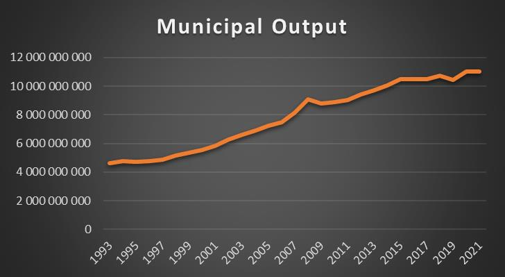
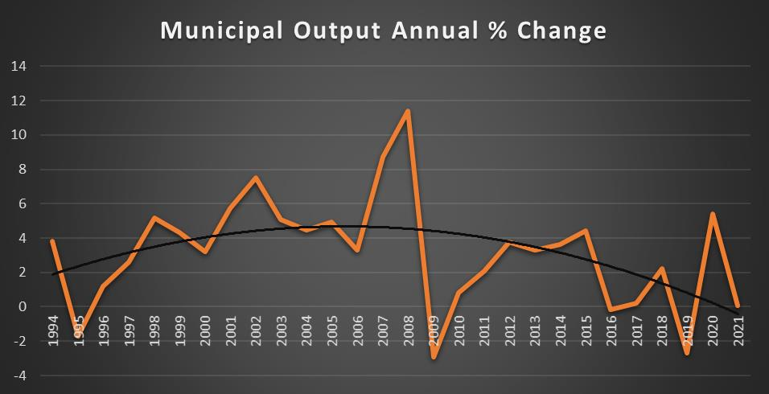
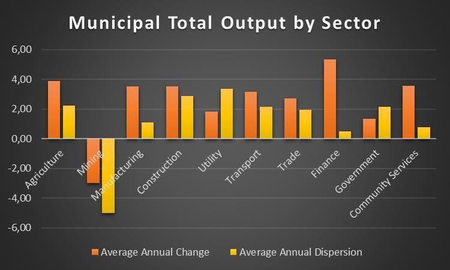
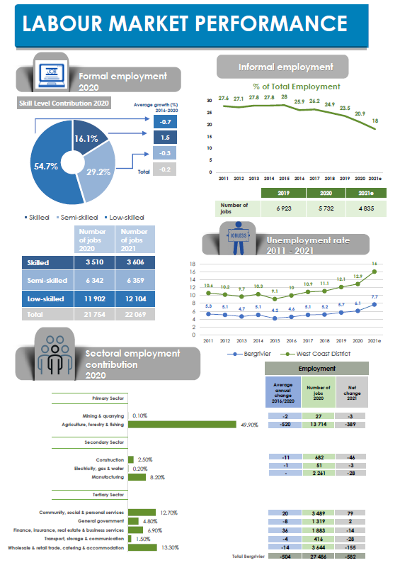
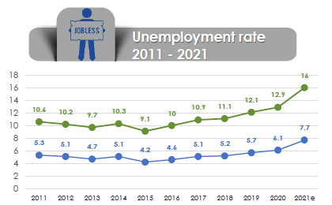

# The Local Economy

The size of the Bergrivier municipal area’s economy (according to Quantec Easy Data, 2022) is estimated at R 11.02 billion (Output at constant 2015 prices) in 2020, with 28 361 people employed and 2 122 people unemployed. The Municipal trend in total output is presented in the below figure. A clear stagnation trend is evident post-2015. Further research is needed to explore the various causes for this specifically to understand the national versus local reasons for the stagnating trend. Institutively there will be some combination of national versus local causes. National causes could be electricity-related for example, while local causes could be tariff-related. An understanding of these causes should be a priority. In general, the Municipal economy increased by 139 % over a 28-year period. Ideally, the period should be as little as possible targeting around 15 years.

<figure><figcaption>
IHS MARKIT
</figcaption></figure>

The stagnating trend in total Municipal output is again evident in the below figure as presented by the polynomial function (black line). The figure presents the annual percentage change (%) in the total Municipal output over the period. It is also evident that the growth rate is relatively volatile or unstable. This proposes significant local causes or business fluctuations in the Municipal economy.

The following table (in Rand millions) indicates the sectoral contribution to employment and GDPR in the Bergrivier Municipal Area from 1993 to 2020. The largest contributors to the economy of the Bergrivier Municipal Area were the agriculture sector and the manufacturing sector, which accounted for 39.2 % and 28.4 % of total output respectively in 2020. The mining, utilities, and construction sectors are almost non-existent in the Municipality. In general, the economic structure of the Municipal area has not changed significantly over the period.

<figure><figcaption>
IHS MARKIT
</figcaption></figure>

Estimates for 2021 however indicate a marked recovery in growth (6.5 %) from the effects of the COVID-19 related restrictions to economic activity in 2020. This growth was driven by recovery growth in a number of sectors, including manufacturing (9.5 %), wholesale& retail trade, catering& accommodation (6.9 %) ; finance, insurance, real estate & business services (5.3 %); agriculture, forestry and fishing (8.7 %) and community, social and personalservices(9.0 %)sectors. The mining& quarrying (-17.1 %), construction (-5.0 %) and general government (-0.4 %) sectors were the only sectors that experienced further economic decline after the easing of restrictions. Despite the economic recovery experienced in 2021, the economy continued to shed jobs, with an estimated 582 net jobs lost. This was largely driven by job losses in the agriculture, forestry & fishing (- 386), wholesale & retail trade, catering & accommodation (-155 jobs) and construction (-46)sectors, reflecting that employment creation is lagging the improved GDP. Only the community, social & personal services (79) and general government sectors were able to create jobs during the year.

**Sectoral Overview**

<figure><figcaption></figcaption></figure>

<figure><figcaption>
IHS MARKIT
</figcaption></figure>

The figure below displays the average annual percentage change and average annual dispersion (volatility) of the various economic sectors within the Municipality. The data propose that the finance sector recorded the fastest average annual growth rate, while the mining sector recorded decreasing growth rates over the period. In absolute terms, the Mining sector was also the most volatile sector in the Municipality over the period, while the finance sector was the least volatile. The performance of the agriculture and manufacturing sectors should be commended given the national trends in these sectors. A primary and secondary sector-focused economy is the most sustainable economy in the long term. These sectors are engines of economic growth and development. What is required in value-add opportunities be it downstream or upstream.

<figure><figcaption>
IHS MARKIT
</figcaption></figure>

The below two tables display the regional economic output within the Municipality for 2010 (left) and 2021 (right). The data is in 2010 constant terms and therefore not equal to the total Municipal output as presented above. However, the percent contributions will not be affected by the rebasing of the output values. From the data, it is evident that the contribution of the Piketberg economy to the total municipal economy stayed relatively the same while the Velddrif economic contribution increased. On the other hand, the De Hoek economic contribution decreased. The data as proposed in the two tables makes for interesting reading and suggests future economic hotspots and the associated need for infrastructure support.

<figure><figcaption>
IHS MARKIT
</figcaption></figure>

The largest employer in the region was the agriculture sector, which contributed 50.4 % to total employment. In the agriculture sector, the employment concentration in relation to the contribution to economic growth indicates that the sector is labour-intensive, whereas the manufacturing sector, with its contribution of 7.7 % to total employment, is a more capital-intensive and technology-oriented sector. As the following figure shows, the mining sector contributed the least in terms of GDPR and employment in the municipal area (0.7 % and 0.1 % respectively).

**Formal and Informal Employment**

It is estimated that the Bergrivier region’s total employed in 2021 amounts to 26 904 workers of which 22 069 (82.0 %) are in the formal sector while 4 835 (18.0 %) are informally employed, showing a drop in proportion of informally employed workers. Informal employment has been on a declining trend since 2015, while overall formal employment has contracted at an average annual rate of 0.2 % between 2016 and 2020. The informal economy absorbed the majority of the job losses in 2021. This is concerning as the informal economy is expected to act as a buffer during times of economic recession.

Most of the formally employed consisted of low-skilled (54.7 %) and semi-skilled (29.2 %) workers. Although the skilled category only contributed 16.1 % to total formal employment (2020), it outpaced the other two categories in terms of average annual growth –between 2016 and 2020, the skilled cohort grew on average by 1.5 %, while the semi- and low-skilled categories contracted at 0.3 and 0.7 % respectively over the same period. The growth in the skilled category reflectsthe market demand for more skilled labour and the ability to sustain and even expand skilled employment even during difficult economic times. Evidently, the demand for skilled labour is on the rise which implies the need to capacitate and empower low-skilled and semi-skilled workers.

<figure><figcaption>
SEP 2022
</figcaption></figure>

**Skills analysis**

In 2010, 2014 and 2017, the municipal area experienced significant job losses owing to periods of poor economic performance, low commodity prices, higher consumer prices, lower investment levels, household dependency on credit and policy uncertainty. A total of 529 jobs were shed in 2010, 166 were shed in 2014 and 243 were shed in 2017 in the municipal area, with low-skilled workers being significantly affected. While net employment improved for skilled and semi-skilled workers in 2011, low-skilled workers experienced a net decline in 2011 (145 jobs). Despite the contracting GDPR, the municipal area showed resilience in 2018 and 2019, creating 183 skilled, 134 semi-skilled and 330 low-skilled jobs, with a total of 647 jobs. However, COVID- 19 is estimated to have impacted the municipal area severely owing to financial pressure. It is estimated that 1 024 jobs were lost in 2020, with an estimated 563 low-skilled workers losing their jobs. The economic pressure caused by the job losses will put pressure on households to pay for basic services, meaning that the Municipality will have pressure from increased demand for free basic services. As demonstrated in the following figure, most formally employed workers in the Bergrivier municipal area were low-skilled in 2019.

Low-skilled workers were concentrated in the agriculture sector and the community services sector, accounting for 75.6 % and 68.7 % of the sector’s total employment respectively. Since the agriculture sector is predominantly composed of low-skilled work, the sector is vulnerable to economic shocks, which may increase poverty levels if the workers in the agriculture sector are not upskilled.

The electricity, gas and water sector employed the most semi-skilled workers in 2019, accounting for 62.5 %, while the community services sector employed the fewest (13.0 %). In the Bergrivier municipal area, 14.3 % of the workforce were classified as skilled labourers, with the majority employed in the general government sector (37.6 %). One of the most important roles of local government is to foster an enabling environment that encourages local economic development. This has been particularly important during the COVID-19 pandemic, which is causing significant economic distress. The Bergrivier Municipality, through the implementation of a variety of programmes, is working towards increasing employment opportunities within the municipal area. The Expanded Public Works Programme, a government-funded programme aimed at reducing poverty and unemployment, is one such example. The programme’s goal is to boost economic growth by enhancing skills through education and training. It also strives to provide a conducive climate for business to thrive. Contractors will use labour-intensive construction methods in the programme, which will help to develop additional skills.

**Unemployment**

<figure><figcaption>
SEP 2022
</figcaption></figure>

Unemployment rates in the District ranges from a high of 23.1 % in Saldanha Bay to a low of 7.7 % in Bergrivier area. The Bergrivier area’s unemployment rate has been on an upward trend since 2015 (4.2 %). The proportion of the not economically active population has also increased from 2020 to 2021 as job losses and an insufficient supply of jobs have led to an increasing number of discouraged work-seekers. Unfortunately, most job losses affected informal workers who are more vulnerable to living in poverty during times of tough economic times. The unemployment rates are concerning given that this estimate is based on the narrow definition of unemployment i.e. the percentage of people that are actively looking for work, but unable to find employment. In turn, the broad definition refers to people that want to work but are not actively seeking employment (excludes those who have given up looking for work).

<figure><figcaption>
MERO 2022
</figcaption></figure>
