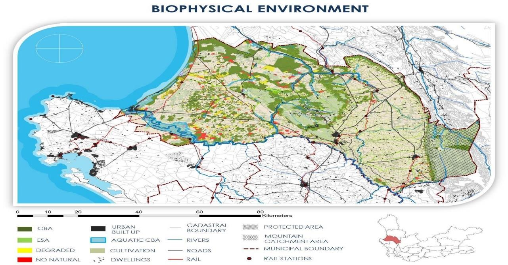

# The Natural Environment

The Environment is a concurrent National and Provincial competency in terms Part A of Schedule 4 of the Constitution of the Republic of South Africa, 1996. The Municipal Systems Act requires municipalities to work together with other organs of state to contribute to the progressive realisation of the right to environment (Section 23). The Constitution of the Republic of South Africa, 1996 (Section 24) states that

“Everyone has the right -

(a) to an environment that is not harmful to their health or well-being:

(b) to have the environment protected, for the benefit of present and future generations; through reasonable legislative and other measures that:

1. prevent pollution and ecological degradation;
2. promote conservation; and
3. secure ecologically sustainable development and use of natural resources while promoting justifiable economic and social development” .

In addition, there are numerous other statutes that give a defined role to municipalities in the conservation and sustainable development of the environment. There are also statutes that regulate the way in which municipalities perform their functions to ensure minimal negative impact to the environment.

Bergrivier Municipality consciously strives to conserve the natural environment by minimising the impact of its own activities. There are several factors that impact on the environment, one of the most critical being poverty which forces impoverished people to rely on natural resources which are often used unsustainably. Conversely private and public development initiatives which are needed to address poverty also have the potential to impact negatively on the environment if not managed correctly. The challenge that the Municipality faces is to ensure that all development is done in a sustainable manner.

The list of issues surrounding our environment goes on, but there are three major ones that affect most of them overall: global warming and climate change; water pollution and ocean acidification; and loss of biodiversity, overexploitation of natural resources, erosion along the coastal areas and the Berg River Estuary. Bergrivier Municipality, as all local municipalities, according to the Constitution of the Republic of South Africa, 1996: “has executive authority in respect of, and has the right to administer – (a) the local government matters listed in Part B of Schedule 4 and Part B of Schedule 5 and (b) any other matters assigned to it by National of Provincial legislation”.

The Municipality received accolades for its work in climate change adaptation and biodiversity management in the Greenest Municipality Competition.

<figure><figcaption></figcaption></figure>
